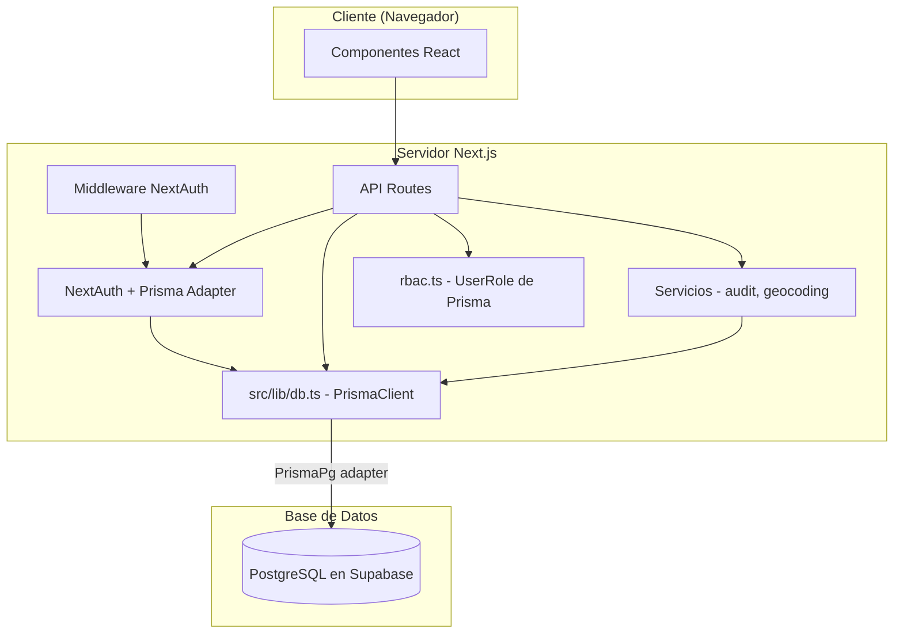
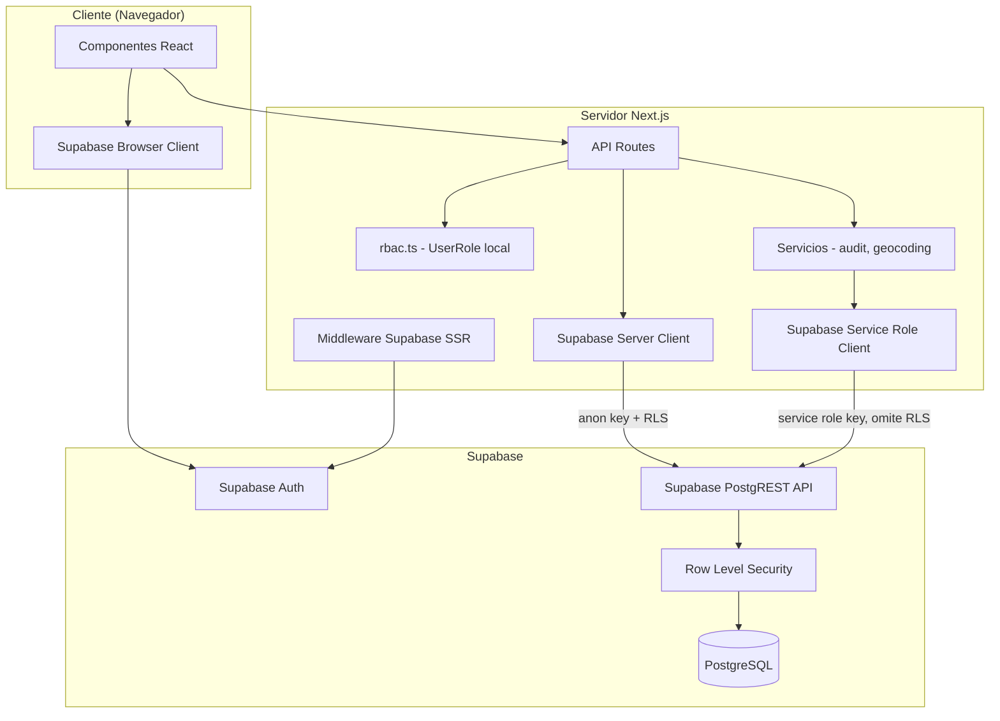
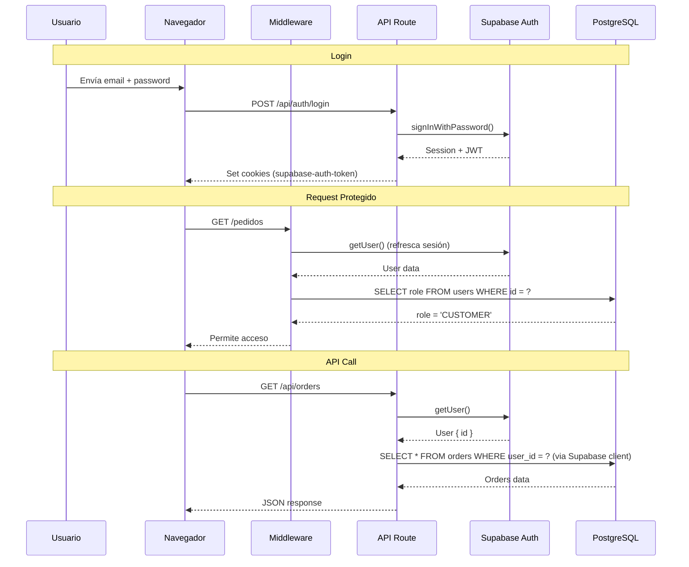

# Documento de Diseño — Migración de Prisma a Supabase

## Visión General

Este documento describe el diseño técnico para migrar **monte-delivery** de Prisma ORM + NextAuth a **Supabase Client + Supabase Auth**. La migración afecta exclusivamente la capa de acceso a datos y autenticación — la base de datos PostgreSQL existente en Supabase se mantiene intacta, al igual que la lógica de dominio (haversine, ETA, FSM de pedidos, slots).

### Objetivos

- Unificar el stack con el proyecto hermano **gitan-app** que ya usa `@supabase/supabase-js` + `@supabase/ssr`
- Eliminar Prisma ORM, NextAuth y `bcryptjs` como dependencias
- Adoptar Supabase Auth para registro, login, logout y recuperación de contraseña
- Migrar 30+ rutas API de Prisma queries a Supabase client queries
- Mantener el sistema RBAC existente con tipos de Supabase
- Implementar políticas RLS básicas para tablas accedidas con anon key

### Decisiones de Diseño Clave

| Decisión | Elección | Justificación |
|----------|----------|---------------|
| Patrón de cliente Supabase | Replicar estructura de gitan-app (`server.ts`, `client.ts`, `middleware.ts`) | Consistencia entre proyectos, patrón probado |
| Generación de tipos | `supabase gen types typescript` → `src/types/database.ts` | Mismo patrón que gitan-app, tipos siempre sincronizados con el esquema |
| Transacciones Prisma | Funciones RPC de Supabase para operaciones atómicas críticas (crear pedido) | Única forma de garantizar atomicidad sin Prisma `$transaction` |
| Sesión de usuario | `supabase.auth.getUser()` en cada request protegido | Reemplaza `auth()` de NextAuth, valida JWT contra Supabase Auth |
| Rol del usuario | Consulta a tabla `users` tras obtener el auth user | Mismo patrón que gitan-app, el rol vive en la tabla `users` |
| Service Role Key | Solo para seed, servicios internos (audit, geocoding) y operaciones admin | Omite RLS, necesario para operaciones que no tienen contexto de usuario |

### Alcance

**Dentro del alcance:**
- Configuración de clientes Supabase (servidor, navegador, middleware, service role)
- Generación de tipos TypeScript desde esquema Supabase
- Migración completa de autenticación (registro, login, logout, reset password)
- Migración del middleware de NextAuth a Supabase Auth
- Migración de todas las rutas API (lectura y escritura)
- Migración de servicios internos (audit, geocoding)
- Migración del sistema RBAC
- Migración del script de seed
- Gestión de dependencias y variables de entorno
- Limpieza de archivos obsoletos
- Políticas RLS básicas

**Fuera del alcance:**
- Cambios en el esquema de la base de datos
- Migración de la lógica de dominio (ya es pura, sin dependencias de Prisma)
- Cambios en la UI/UX de los componentes
- Migración de Google OAuth (se elimina en esta fase)

---

## Arquitectura

### Arquitectura Actual (Prisma + NextAuth)



### Arquitectura Objetivo (Supabase Client + Supabase Auth)



### Flujo de Autenticación



---

## Componentes e Interfaces

### 1. Clientes Supabase (`src/lib/supabase/`)

Se crean tres archivos siguiendo el patrón exacto de gitan-app:

#### `src/lib/supabase/server.ts` — Cliente de Servidor

```typescript
// Uso: Server Components, API Routes, Server Actions
import { createServerClient } from "@supabase/ssr";
import { cookies } from "next/headers";

export async function createClient() {
  const cookieStore = await cookies();
  return createServerClient(
    process.env.NEXT_PUBLIC_SUPABASE_URL!,
    process.env.NEXT_PUBLIC_SUPABASE_ANON_KEY!,
    {
      cookies: {
        getAll() { return cookieStore.getAll(); },
        setAll(cookiesToSet) {
          try {
            cookiesToSet.forEach(({ name, value, options }) =>
              cookieStore.set(name, value, options)
            );
          } catch { /* Server Component — ignorar */ }
        },
      },
    }
  );
}
```

#### `src/lib/supabase/client.ts` — Cliente de Navegador

```typescript
// Uso: Client Components
import { createBrowserClient } from "@supabase/ssr";

export function createClient() {
  return createBrowserClient(
    process.env.NEXT_PUBLIC_SUPABASE_URL!,
    process.env.NEXT_PUBLIC_SUPABASE_ANON_KEY!
  );
}
```

#### `src/lib/supabase/middleware.ts` — Utilidad de Middleware

```typescript
// Uso: src/middleware.ts — refresca sesión en cada request
import { createServerClient } from "@supabase/ssr";
import { NextResponse, type NextRequest } from "next/server";

export async function updateSession(request: NextRequest) {
  let supabaseResponse = NextResponse.next({ request });
  const supabase = createServerClient(
    process.env.NEXT_PUBLIC_SUPABASE_URL!,
    process.env.NEXT_PUBLIC_SUPABASE_ANON_KEY!,
    {
      cookies: {
        getAll() { return request.cookies.getAll(); },
        setAll(cookiesToSet) {
          cookiesToSet.forEach(({ name, value }) => request.cookies.set(name, value));
          supabaseResponse = NextResponse.next({ request });
          cookiesToSet.forEach(({ name, value, options }) =>
            supabaseResponse.cookies.set(name, value, options)
          );
        },
      },
    }
  );
  const { data: { user } } = await supabase.auth.getUser();
  if (!user && !isPublicRoute(request.nextUrl.pathname)) {
    const url = request.nextUrl.clone();
    url.pathname = "/auth/login";
    return NextResponse.redirect(url);
  }
  return supabaseResponse;
}
```

#### `src/lib/supabase/service.ts` — Cliente Service Role

```typescript
// Uso: Seed, servicios internos, operaciones admin que omiten RLS
import { createClient as createSupabaseClient } from "@supabase/supabase-js";

export function createServiceClient() {
  return createSupabaseClient(
    process.env.NEXT_PUBLIC_SUPABASE_URL!,
    process.env.SUPABASE_SERVICE_ROLE_KEY!
  );
}
```

### 2. Tipos Generados (`src/types/database.ts`)

Los tipos se generan con `supabase gen types typescript` y se almacenan en `src/types/database.ts`, siguiendo el patrón de gitan-app. Además, se definen tipos auxiliares locales para los enums:

```typescript
// src/types/database.ts (generado por supabase gen types)
export type Database = {
  public: {
    Tables: {
      users: { Row: { id: string; name: string; email: string; role: UserRole; ... }; Insert: ...; Update: ...; };
      restaurants: { Row: ...; Insert: ...; Update: ...; };
      // ... 22 tablas
    };
    Enums: {
      UserRole: "CUSTOMER" | "RESTAURANT_OWNER" | "RESTAURANT_STAFF" | "ADMIN";
      RestaurantUserRole: "OWNER" | "STAFF";
      OrderStatus: "PLACED" | "ACCEPTED" | "REJECTED" | "PREPARING" | "READY_FOR_PICKUP" | "OUT_FOR_DELIVERY" | "DELIVERED" | "CANCELLED";
      FulfillmentType: "ASAP" | "SCHEDULED";
      ConsentType: "NECESSARY" | "ANALYTICS" | "MARKETING";
    };
  };
};

// Tipos auxiliares extraídos
export type UserRole = Database["public"]["Enums"]["UserRole"];
export type OrderStatus = Database["public"]["Enums"]["OrderStatus"];
export type FulfillmentType = Database["public"]["Enums"]["FulfillmentType"];
// etc.
```

### 3. Middleware de Autenticación y RBAC (`src/middleware.ts`)

El middleware se reestructura para usar Supabase Auth en lugar de NextAuth:

```typescript
// src/middleware.ts
import { NextResponse, type NextRequest } from "next/server";
import { createServerClient } from "@supabase/ssr";

// Rutas públicas que no requieren autenticación
const PUBLIC_PATHS = ["/", "/auth/login", "/auth/registro", "/auth/reset-password", "/auth/callback"];
const CUSTOMER_PATHS = ["/carrito", "/checkout", "/pedidos", "/perfil"];
const PANEL_PATHS = ["/panel"];
const ADMIN_PATHS = ["/admin"];

export async function middleware(request: NextRequest) {
  // 1. Refrescar sesión
  const { updateSession } = await import("@/lib/supabase/middleware");
  const response = await updateSession(request);
  if (response.headers.get("location")) return response;

  const { pathname } = request.nextUrl;

  // 2. Rutas públicas — permitir
  if (isPublicPath(pathname)) return response;

  // 3. Obtener usuario y rol
  const supabase = createServerClient(/* ... cookies del request ... */);
  const { data: { user } } = await supabase.auth.getUser();
  if (!user) return redirectToLogin(request);

  const { data: profile } = await supabase
    .from("users").select("role").eq("id", user.id).single();
  const role = profile?.role;

  // 4. Verificar permisos por ruta
  if (matchesAny(pathname, ADMIN_PATHS) && role !== "ADMIN") return redirectToHome(request);
  if (matchesAny(pathname, PANEL_PATHS) && !["RESTAURANT_OWNER", "RESTAURANT_STAFF"].includes(role)) return redirectToHome(request);

  // 5. Headers de seguridad
  response.headers.set("X-Frame-Options", "DENY");
  response.headers.set("X-Content-Type-Options", "nosniff");
  response.headers.set("Referrer-Policy", "strict-origin-when-cross-origin");

  return response;
}
```

### 4. Sistema RBAC (`src/lib/auth/rbac.ts`)

El RBAC se mantiene idéntico en estructura, solo cambia la fuente del tipo `UserRole`:

```typescript
// ANTES: import { UserRole } from '@/generated/prisma/client';
// DESPUÉS:
import type { UserRole } from '@/types/database';

// El resto del archivo (ROLE_PERMISSIONS, hasPermission, requirePermission) no cambia
```

### 5. Helper de Autenticación para API Routes

Se crea un helper reutilizable para obtener el usuario autenticado en API routes:

```typescript
// src/lib/auth/session.ts
import { createClient } from "@/lib/supabase/server";

export interface AuthUser {
  id: string;
  email: string;
}

export interface AuthUserWithRole extends AuthUser {
  role: UserRole;
}

export async function getAuthUser(): Promise<AuthUser | null> {
  const supabase = await createClient();
  const { data: { user } } = await supabase.auth.getUser();
  if (!user) return null;
  return { id: user.id, email: user.email! };
}

export async function getAuthUserWithRole(): Promise<AuthUserWithRole | null> {
  const supabase = await createClient();
  const { data: { user } } = await supabase.auth.getUser();
  if (!user) return null;

  const { data: profile } = await supabase
    .from("users").select("role").eq("id", user.id).single();
  if (!profile) return null;

  return { id: user.id, email: user.email!, role: profile.role as UserRole };
}
```

---

## Migración de Rutas API — Patrones de Traducción

### Patrón General: Lectura

```typescript
// ANTES (Prisma)
const restaurants = await prisma.restaurant.findMany({
  where: { isActive: true },
  include: { openingHours: true },
  orderBy: { name: 'asc' },
  skip: 0,
  take: 10,
});

// DESPUÉS (Supabase)
const supabase = await createClient();
const { data: restaurants, error } = await supabase
  .from('restaurants')
  .select('*, opening_hours(*)')
  .eq('is_active', true)
  .order('name', { ascending: true })
  .range(0, 9);
```

### Patrón General: Escritura

```typescript
// ANTES (Prisma)
const user = await prisma.user.create({
  data: { name, email, passwordHash, role: 'CUSTOMER' },
});

// DESPUÉS (Supabase)
const supabase = await createClient();
const { data: user, error } = await supabase
  .from('users')
  .insert({ name, email, password_hash: passwordHash, role: 'CUSTOMER' })
  .select()
  .single();
```

### Patrón General: Transacciones

```typescript
// ANTES (Prisma)
const order = await prisma.$transaction(async (tx) => {
  const newOrder = await tx.order.create({ data: { ... } });
  await tx.orderItem.createMany({ data: items });
  await tx.orderStatusHistory.create({ data: { ... } });
  await tx.cartItem.deleteMany({ where: { cartId } });
  return newOrder;
});

// DESPUÉS (Supabase RPC)
// Se crea una función SQL en Supabase:
// CREATE FUNCTION create_order_transaction(...)
// RETURNS json AS $$ ... $$ LANGUAGE plpgsql;

const { data: order, error } = await supabase.rpc('create_order_transaction', {
  p_user_id: userId,
  p_restaurant_id: restaurantId,
  p_items: JSON.stringify(items),
  // ...
});
```

### Patrón: Autenticación en API Routes

```typescript
// ANTES
const session = await auth();
if (!session?.user?.id) return NextResponse.json({ error: 'No autenticado' }, { status: 401 });
const userId = session.user.id;

// DESPUÉS
const authUser = await getAuthUser();
if (!authUser) return NextResponse.json({ error: 'No autenticado' }, { status: 401 });
const userId = authUser.id;
```

### Inventario Completo de Rutas API a Migrar

| Ruta | Métodos | Tipo de Operación | Complejidad |
|------|---------|-------------------|-------------|
| `/api/auth/register` | POST | Escritura + Supabase Auth | Alta |
| `/api/auth/login` | POST | Supabase Auth | Alta |
| `/api/auth/logout` | POST | Supabase Auth | Baja |
| `/api/auth/forgot-password` | POST | Supabase Auth | Media |
| `/api/auth/reset-password` | POST | Supabase Auth | Media |
| `/api/restaurants` | GET | Lectura | Baja |
| `/api/restaurants/[slug]` | GET | Lectura con relaciones | Media |
| `/api/restaurants/nearby` | GET | Lectura con filtros | Media |
| `/api/restaurants/[slug]/available-slots` | GET | Lectura | Baja |
| `/api/cart` | GET, DELETE | Lectura/Escritura | Media |
| `/api/cart/items` | POST | Escritura | Media |
| `/api/cart/items/[itemId]` | PATCH, DELETE | Escritura | Baja |
| `/api/orders` | GET, POST | Lectura/Transacción | Alta |
| `/api/orders/[id]` | GET | Lectura con relaciones | Media |
| `/api/orders/[id]/cancel` | POST | Escritura | Media |
| `/api/orders/[id]/confirm` | POST | Escritura | Media |
| `/api/addresses` | GET, POST | Lectura/Escritura | Baja |
| `/api/addresses/[id]` | PATCH, DELETE | Escritura | Baja |
| `/api/admin/users` | GET | Lectura | Baja |
| `/api/admin/restaurants` | GET, POST, PATCH | Lectura/Escritura | Media |
| `/api/admin/products` | GET, POST | Lectura/Escritura | Media |
| `/api/admin/categories` | GET, POST, PATCH, DELETE | CRUD | Media |
| `/api/admin/orders` | GET | Lectura | Baja |
| `/api/admin/metrics` | GET | Lectura agregada | Media |
| `/api/admin/audit-log` | GET | Lectura | Baja |
| `/api/restaurant/catalog` | GET | Lectura | Baja |
| `/api/restaurant/catalog/categories` | POST, PATCH, DELETE | CRUD | Media |
| `/api/restaurant/catalog/products` | POST, PATCH, DELETE | CRUD | Media |
| `/api/restaurant/orders` | GET | Lectura | Baja |
| `/api/restaurant/orders/[id]/accept` | POST | Escritura | Media |
| `/api/restaurant/orders/[id]/reject` | POST | Escritura | Media |
| `/api/restaurant/orders/[id]/status` | PATCH | Escritura | Media |
| `/api/restaurant/staff` | GET | Lectura | Baja |
| `/api/restaurant/staff/invite` | POST | Escritura + Auth | Alta |
| `/api/consent` | GET, POST | Lectura/Escritura | Baja |
| `/api/phone-verification/send` | POST | Escritura | Baja |
| `/api/phone-verification/verify` | POST | Escritura | Baja |
| `/api/user/export-data` | GET | Lectura múltiple | Media |
| `/api/user/delete-account` | DELETE | Escritura + Auth | Alta |
| `/api/geocoding/candidates` | GET | Lectura (servicio externo) | Baja |

### Función RPC para Crear Pedido

La operación más compleja es la creación de pedido, que actualmente usa `prisma.$transaction`. Se implementa como función RPC:

```sql
-- supabase/migrations/xxx_create_order_transaction.sql
CREATE OR REPLACE FUNCTION create_order_transaction(
  p_user_id UUID,
  p_restaurant_id UUID,
  p_address_id UUID,
  p_phone TEXT,
  p_fulfillment_type fulfillment_type,
  p_scheduled_for TIMESTAMPTZ,
  p_subtotal_eur NUMERIC(10,2),
  p_delivery_fee_eur NUMERIC(10,2),
  p_total_eur NUMERIC(10,2),
  p_eta TIMESTAMPTZ,
  p_eta_window_end TIMESTAMPTZ,
  p_idempotency_key TEXT,
  p_items JSONB -- [{product_id, product_name, product_price_eur, quantity}]
) RETURNS JSONB
LANGUAGE plpgsql
SECURITY DEFINER
AS $$
DECLARE
  v_order orders%ROWTYPE;
  v_cart_id UUID;
  v_item JSONB;
BEGIN
  -- Crear pedido
  INSERT INTO orders (user_id, restaurant_id, address_id, phone, fulfillment_type,
    scheduled_for, subtotal_eur, delivery_fee_eur, total_eur, current_status,
    eta, eta_window_end, idempotency_key)
  VALUES (p_user_id, p_restaurant_id, p_address_id, p_phone, p_fulfillment_type,
    p_scheduled_for, p_subtotal_eur, p_delivery_fee_eur, p_total_eur, 'PLACED',
    p_eta, p_eta_window_end, p_idempotency_key)
  RETURNING * INTO v_order;

  -- Crear items del pedido
  FOR v_item IN SELECT * FROM jsonb_array_elements(p_items)
  LOOP
    INSERT INTO order_items (order_id, product_id, product_name, product_price_eur, quantity)
    VALUES (v_order.id, (v_item->>'product_id')::UUID, v_item->>'product_name',
      (v_item->>'product_price_eur')::NUMERIC(10,2), (v_item->>'quantity')::INT);
  END LOOP;

  -- Historial de estado inicial
  INSERT INTO order_status_history (order_id, from_status, to_status, changed_by_user_id)
  VALUES (v_order.id, NULL, 'PLACED', p_user_id);

  -- Limpiar carrito
  SELECT id INTO v_cart_id FROM carts WHERE user_id = p_user_id;
  IF v_cart_id IS NOT NULL THEN
    DELETE FROM cart_items WHERE cart_id = v_cart_id;
    UPDATE carts SET restaurant_id = NULL WHERE id = v_cart_id;
  END IF;

  RETURN jsonb_build_object(
    'id', v_order.id,
    'order_number', v_order.order_number,
    'current_status', v_order.current_status,
    'total_eur', v_order.total_eur,
    'eta', v_order.eta,
    'eta_window_end', v_order.eta_window_end,
    'created_at', v_order.created_at
  );
END;
$$;
```

---

## Modelos de Datos

### Mapeo de Nombres: Prisma → Supabase

Prisma usa camelCase para campos; las tablas PostgreSQL en Supabase usan snake_case. El mapeo es directo gracias a los `@@map` del schema Prisma:

| Modelo Prisma | Tabla Supabase | Campos Clave (camelCase → snake_case) |
|---------------|----------------|---------------------------------------|
| `User` | `users` | `emailVerified` → `email_verified`, `passwordHash` → `password_hash`, `failedLoginAttempts` → `failed_login_attempts`, `lockedUntil` → `locked_until` |
| `Restaurant` | `restaurants` | `deliveryFeeEur` → `delivery_fee_eur`, `minOrderEur` → `min_order_eur`, `deliveryRadiusKm` → `delivery_radius_km`, `isActive` → `is_active` |
| `Order` | `orders` | `orderNumber` → `order_number`, `currentStatus` → `current_status`, `subtotalEur` → `subtotal_eur`, `deliveryFeeEur` → `delivery_fee_eur`, `totalEur` → `total_eur`, `idempotencyKey` → `idempotency_key` |
| `Product` | `products` | `priceEur` → `price_eur`, `isAvailable` → `is_available`, `categoryId` → `category_id` |
| `CartItem` | `cart_items` | `cartId` → `cart_id`, `productId` → `product_id` |
| `OrderItem` | `order_items` | `orderId` → `order_id`, `productName` → `product_name`, `productPriceEur` → `product_price_eur` |
| `OpeningHour` | `opening_hours` | `restaurantId` → `restaurant_id`, `dayOfWeek` → `day_of_week`, `openTime` → `open_time`, `closeTime` → `close_time` |
| `Address` | `addresses` | `postalCode` → `postal_code`, `floorDoor` → `floor_door` |
| `OrderStatusHistory` | `order_status_history` | `fromStatus` → `from_status`, `toStatus` → `to_status`, `changedByUserId` → `changed_by_user_id` |
| `GeocodingCache` | `geocoding_cache` | `normalizedAddress` → `normalized_address`, `comunidadAutonoma` → `comunidad_autonoma` |
| `AdminAuditLog` | `admin_audit_log` | `resourceType` → `resource_type`, `resourceId` → `resource_id`, `ipAddress` → `ip_address` |

### Tipos Auxiliares para DTOs

Los DTOs existentes en `src/types/index.ts` (`RestaurantDTO`, `ProductDTO`, `OrderDTO`, `CartDTO`, etc.) se mantienen sin cambios — son independientes de Prisma. Solo se actualizan las importaciones de enums.

### Políticas RLS

| Tabla | Política | Descripción |
|-------|----------|-------------|
| `users` | `SELECT` propio perfil | `auth.uid() = id` |
| `users` | `UPDATE` propio perfil | `auth.uid() = id` |
| `carts` | CRUD propio carrito | `auth.uid() = user_id` |
| `cart_items` | CRUD propios items | `auth.uid() = (SELECT user_id FROM carts WHERE id = cart_id)` |
| `addresses` | CRUD propias direcciones | `auth.uid() = user_id` |
| `orders` | `SELECT` propios pedidos | `auth.uid() = user_id` |
| `restaurants` | `SELECT` todos (públicos) | `true` (lectura pública) |
| `opening_hours` | `SELECT` todos | `true` |
| `categories` | `SELECT` todos | `true` |
| `products` | `SELECT` todos | `true` |
| `allergens` | `SELECT` todos | `true` |
| `product_allergens` | `SELECT` todos | `true` |

Las tablas administrativas (`admin_audit_log`, `restaurant_users`, `order_status_history`) se acceden exclusivamente con Service Role Key, por lo que no necesitan políticas RLS para anon key.

### Gestión de Dependencias

**Añadir:**
- `@supabase/supabase-js` (dependencia)
- `@supabase/ssr` (dependencia)
- `supabase` (devDependency — CLI para generación de tipos)

**Eliminar:**
- `prisma`
- `@prisma/client`
- `@prisma/adapter-pg`
- `@auth/prisma-adapter`
- `next-auth`
- `bcryptjs`

### Variables de Entorno

**Añadir:**
```env
# Supabase
NEXT_PUBLIC_SUPABASE_URL=https://xxxxx.supabase.co
NEXT_PUBLIC_SUPABASE_ANON_KEY=eyJhbGciOiJIUzI1NiIs...
SUPABASE_SERVICE_ROLE_KEY=eyJhbGciOiJIUzI1NiIs...
```

**Eliminar:**
```env
DATABASE_URL=...
NEXTAUTH_URL=...
NEXTAUTH_SECRET=...
GOOGLE_CLIENT_ID=...
GOOGLE_CLIENT_SECRET=...
```

### Archivos a Eliminar

| Archivo | Razón |
|---------|-------|
| `src/lib/db.ts` | Reemplazado por `src/lib/supabase/server.ts` |
| `src/lib/auth/auth.ts` | Reemplazado por helpers de Supabase Auth |
| `src/lib/auth/auth.config.ts` | Configuración de NextAuth ya no necesaria |
| `src/types/next-auth.d.ts` | Augmentación de tipos NextAuth ya no necesaria |
| `src/app/api/auth/[...nextauth]/route.ts` | Catch-all de NextAuth ya no necesario |
| `prisma.config.ts` | Configuración de Prisma ya no necesaria |
| `src/generated/prisma/` | Tipos generados por Prisma, reemplazados por `src/types/database.ts` |

### Archivos a Crear

| Archivo | Propósito |
|---------|-----------|
| `src/lib/supabase/server.ts` | Cliente Supabase para servidor |
| `src/lib/supabase/client.ts` | Cliente Supabase para navegador |
| `src/lib/supabase/middleware.ts` | Utilidad de refresco de sesión |
| `src/lib/supabase/service.ts` | Cliente con Service Role Key |
| `src/lib/auth/session.ts` | Helpers `getAuthUser()` y `getAuthUserWithRole()` |
| `src/types/database.ts` | Tipos generados por Supabase |
| `supabase/migrations/xxx_rls_policies.sql` | Políticas RLS |
| `supabase/migrations/xxx_create_order_transaction.sql` | Función RPC para crear pedido |
| `scripts/seed.ts` | Script de seed migrado |

### Script de Seed Migrado

El seed se reescribe para usar el cliente Supabase con Service Role Key:

```typescript
// scripts/seed.ts
import { createClient } from "@supabase/supabase-js";

const supabase = createClient(
  process.env.NEXT_PUBLIC_SUPABASE_URL!,
  process.env.SUPABASE_SERVICE_ROLE_KEY!
);

async function seed() {
  // 1. Crear usuarios en Supabase Auth + tabla users
  for (const user of USERS) {
    const { data: authUser } = await supabase.auth.admin.createUser({
      email: user.email,
      password: "Password123!",
      email_confirm: true,
      user_metadata: { name: user.name },
    });
    if (authUser.user) {
      await supabase.from("users").insert({
        id: authUser.user.id,
        name: user.name,
        email: user.email,
        role: user.role,
        email_verified: new Date().toISOString(),
      });
    }
  }

  // 2. Insertar alérgenos, restaurantes, categorías, productos, etc.
  await supabase.from("allergens").upsert(EU_ALLERGENS);
  await supabase.from("restaurants").insert(RESTAURANTS.map(r => ({ ... })));
  // ... resto de datos
}
```


---

## Propiedades de Corrección

*Una propiedad es una característica o comportamiento que debe cumplirse en todas las ejecuciones válidas de un sistema — esencialmente, una declaración formal sobre lo que el sistema debe hacer. Las propiedades sirven como puente entre especificaciones legibles por humanos y garantías de corrección verificables por máquinas.*

> **Nota sobre el alcance de PBT en esta migración:** La mayoría de los requisitos de esta migración son verificaciones de configuración (SMOKE), integraciones con servicios externos (INTEGRATION) o escenarios específicos (EXAMPLE). La lógica de dominio pura (haversine, ETA, FSM de pedidos) no se modifica en esta migración. Las únicas propiedades universales testables con PBT son las del sistema RBAC, que es lógica pura con un espacio de entrada bien definido.

### Property 1: Consistencia del mapa de permisos RBAC

*Para cualquier* combinación válida de rol (`CUSTOMER`, `RESTAURANT_OWNER`, `RESTAURANT_STAFF`, `ADMIN`) y permiso del sistema, la función `hasPermission(role, permission)` con tipos de Supabase SHALL devolver el mismo resultado que la implementación original con tipos de Prisma.

**Validates: Requirements 11.2**

### Property 2: Control de acceso por ruta del middleware

*Para cualquier* combinación de rol de usuario y ruta protegida, el middleware SHALL conceder acceso si y solo si el rol tiene permiso para esa categoría de ruta: rutas `/admin/*` solo para `ADMIN`, rutas `/panel/*` solo para `RESTAURANT_OWNER` y `RESTAURANT_STAFF`, rutas `/carrito`, `/checkout`, `/pedidos`, `/perfil` para usuarios autenticados de cualquier rol.

**Validates: Requirements 7.3, 7.6**

---

## Manejo de Errores

### Errores de Autenticación

| Escenario | Código HTTP | Mensaje | Acción |
|-----------|-------------|---------|--------|
| Credenciales inválidas (login) | 401 | "Email o contraseña incorrectos" | No revelar si el email existe |
| Email duplicado (registro) | 409 | "Ya existe una cuenta con este email." | Informar al usuario |
| Error de Supabase Auth (registro) | 500 | "Ha ocurrido un error al crear la cuenta." | Log interno |
| Sesión expirada | 401 | "No autenticado" | Redirigir a login |
| Sin permisos (RBAC) | 403 | "No tienes permisos para realizar esta acción." | Redirigir a home |

### Errores de Acceso a Datos

| Escenario | Código HTTP | Manejo |
|-----------|-------------|--------|
| `error` no nulo en respuesta Supabase | 500 | Log del error, respuesta genérica al cliente |
| Registro no encontrado (`.single()` sin datos) | 404 | Respuesta con mensaje descriptivo |
| Violación de RLS (acceso denegado) | 403 | Log de seguridad, respuesta genérica |
| Error de conexión a Supabase | 500 | Log del error, respuesta genérica |

### Patrón de Manejo de Errores Supabase

```typescript
// Patrón estándar para todas las rutas API
const { data, error } = await supabase.from('tabla').select('*').eq('id', id).single();

if (error) {
  console.error('Error en operación:', error);
  if (error.code === 'PGRST116') {
    // No rows returned
    return NextResponse.json({ error: 'Recurso no encontrado' }, { status: 404 });
  }
  return NextResponse.json({ error: 'Error interno del servidor' }, { status: 500 });
}
```

### Manejo de Transacciones (RPC)

```typescript
// Para la función RPC de crear pedido
const { data, error } = await supabase.rpc('create_order_transaction', params);

if (error) {
  console.error('Error en transacción de pedido:', error);
  // La función RPC hace rollback automático en caso de error
  return NextResponse.json(
    { data: null, error: 'Error al crear el pedido', success: false },
    { status: 500 }
  );
}
```

---

## Estrategia de Testing

### Enfoque Dual

Esta migración requiere un enfoque de testing que combine:

1. **Tests unitarios (example-based)**: Para verificar escenarios específicos de autenticación, manejo de errores y comportamiento de API routes con mocks de Supabase
2. **Tests de propiedad (property-based)**: Para verificar propiedades universales del sistema RBAC
3. **Tests de integración**: Para verificar la interacción real con Supabase (auth, queries, RLS)
4. **Tests de humo (smoke)**: Para verificar configuración, dependencias y limpieza de archivos

### Tests de Propiedad (PBT)

- **Librería**: `fast-check` (ya instalada en el proyecto)
- **Mínimo 100 iteraciones** por test de propiedad
- **Cada test referencia su propiedad del documento de diseño**
- **Formato de tag**: `Feature: prisma-to-supabase-migration, Property {N}: {texto}`

#### Property 1: Consistencia RBAC
```typescript
// Tag: Feature: prisma-to-supabase-migration, Property 1: Consistencia del mapa de permisos RBAC
fc.assert(
  fc.property(
    fc.constantFrom('CUSTOMER', 'RESTAURANT_OWNER', 'RESTAURANT_STAFF', 'ADMIN'),
    fc.constantFrom(...ALL_PERMISSIONS),
    (role, permission) => {
      const result = hasPermission(role, permission);
      const expected = EXPECTED_PERMISSIONS[role].includes(permission);
      return result === expected;
    }
  ),
  { numRuns: 100 }
);
```

#### Property 2: Control de acceso por ruta
```typescript
// Tag: Feature: prisma-to-supabase-migration, Property 2: Control de acceso por ruta del middleware
fc.assert(
  fc.property(
    fc.constantFrom('CUSTOMER', 'RESTAURANT_OWNER', 'RESTAURANT_STAFF', 'ADMIN'),
    fc.constantFrom(...ALL_PROTECTED_ROUTES),
    (role, route) => {
      const allowed = isRouteAllowedForRole(role, route);
      const expected = computeExpectedAccess(role, route);
      return allowed === expected;
    }
  ),
  { numRuns: 100 }
);
```

### Tests Unitarios (Example-Based)

| Área | Tests | Descripción |
|------|-------|-------------|
| Registro | 3-4 | Registro exitoso, email duplicado (409), error de Supabase (500), validación Zod |
| Login | 3-4 | Login exitoso con cookies, credenciales inválidas, error genérico |
| Logout | 2 | Logout exitoso con limpieza de cookies, redirección a login |
| Reset Password | 2-3 | Envío de email, actualización de contraseña, error |
| Middleware | 3-4 | Ruta pública sin auth, ruta protegida sin auth (redirect), ruta protegida con auth correcto, headers de seguridad |
| Cart API | 3-4 | GET carrito vacío, GET carrito con items, DELETE carrito, POST item |
| Orders API | 3-4 | GET pedidos paginados, POST pedido (RPC), pedido duplicado (idempotency) |
| Admin API | 2-3 | Acceso admin permitido, acceso no-admin denegado |
| Audit Service | 2 | Log exitoso, fallo silencioso |
| Geocoding Service | 2-3 | Cache hit, cache miss con API call, fuera de Andalucía |

### Tests de Integración

| Área | Tests | Descripción |
|------|-------|-------------|
| Supabase Auth | 3-4 | Registro + login + logout flow completo |
| RLS Policies | 4-5 | Acceso a datos propios, bloqueo de datos ajenos (por tabla) |
| RPC create_order | 2-3 | Creación exitosa, rollback en error, idempotencia |
| Seed Script | 1-2 | Ejecución completa, verificación de conteos |

### Tests de Humo (Smoke)

| Verificación | Descripción |
|--------------|-------------|
| Dependencias | `@supabase/supabase-js` y `@supabase/ssr` presentes; Prisma, NextAuth, bcryptjs ausentes |
| Archivos eliminados | `db.ts`, `auth.ts`, `auth.config.ts`, `next-auth.d.ts`, `[...nextauth]/route.ts`, `prisma.config.ts` no existen |
| Archivos creados | `supabase/server.ts`, `supabase/client.ts`, `supabase/middleware.ts`, `supabase/service.ts` existen |
| Imports limpios | No quedan imports de `@/lib/db`, `@/generated/prisma`, `next-auth` |
| Variables de entorno | `.env.example` contiene variables de Supabase, no contiene variables de NextAuth |
| Build exitoso | `next build` completa sin errores |
| Tipos generados | `src/types/database.ts` existe y contiene las 22 tablas y 5 enums |

### Orden de Ejecución de Tests

1. **Smoke tests** — Verificar que la migración está completa (archivos, dependencias, imports)
2. **Unit tests** — Verificar lógica de cada componente con mocks
3. **Property tests** — Verificar propiedades universales del RBAC
4. **Integration tests** — Verificar interacción real con Supabase
5. **Build test** — `next build` exitoso
