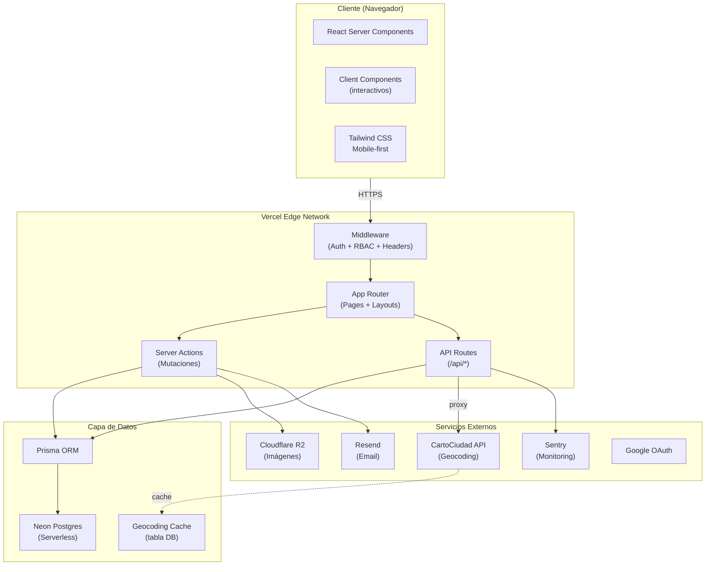
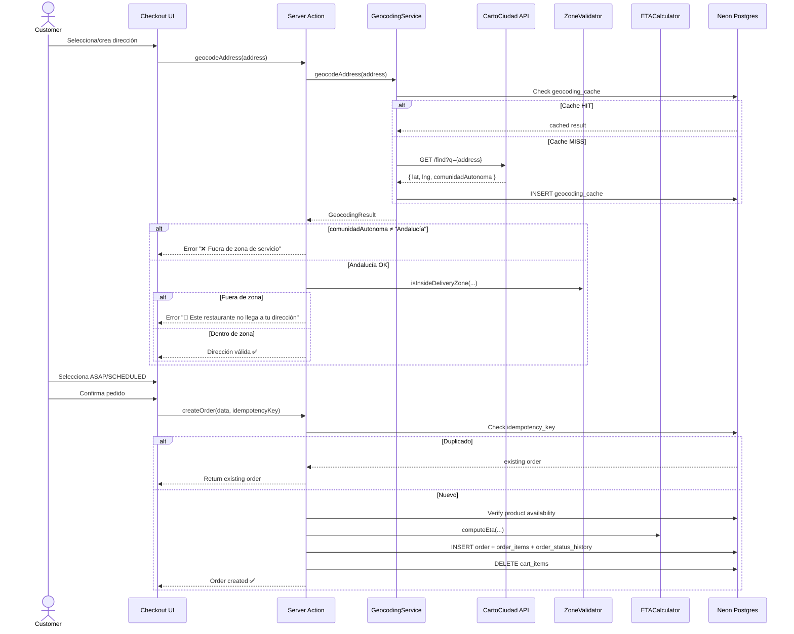
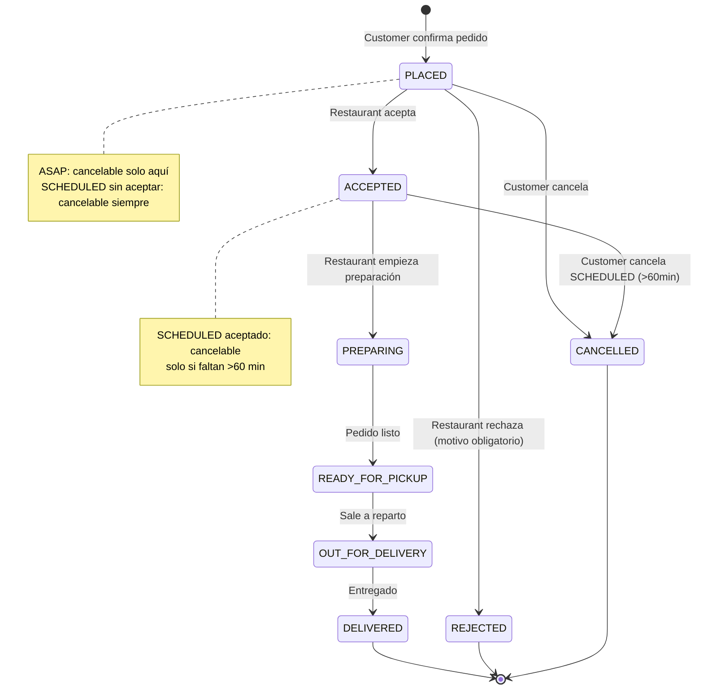
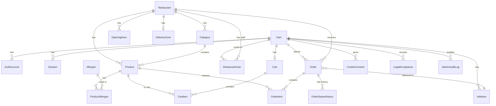

# Documento de Diseño — Pueblo Delivery Marketplace

## Visión General

Pueblo Delivery Marketplace es una aplicación web full-stack de marketplace de delivery para pueblos y ciudades de Andalucía. El sistema conecta clientes con restaurantes locales, permitiendo pedidos ASAP y programados (SCHEDULED), con geocodificación vía CartoCiudad, tracking de pedidos mediante FSM, y cumplimiento normativo europeo (GDPR, ePrivacy, Consumer Rights, Reglamento 1169/2011).

### Decisiones Técnicas Cerradas

| Decisión | Elección | Justificación |
|---|---|---|
| Framework | Next.js App Router + TypeScript | SSR/RSC, Server Actions, despliegue Vercel nativo |
| Estilos | Tailwind CSS | Mobile-first, utility-first, sin runtime CSS |
| ORM | Prisma | Type-safe, migraciones, seed nativo |
| Base de datos | Neon Postgres | Serverless, branching, compatible Vercel |
| Auth | Auth.js v5 (NextAuth) | App Router nativo, Credentials + Google OAuth |
| Geocodificación | CartoCiudad (IGN/CNIG) | Gratuito, gobierno español, sin API key |
| Almacenamiento | Cloudflare R2 | Compatible S3, coste bajo, sin egress fees |
| Email | Resend | API moderna, buen DX, plantillas React |
| Monitorización | Sentry | Error tracking, performance, logs estructurados |
| Pago | Contra entrega (efectivo) | MVP simplificado |
| Realtime | Polling inteligente | MVP; WebSockets en Fase 2 |

### Principios de Diseño

1. **Mobile-first**: Toda la UI se diseña primero para móvil (<640px) y se adapta a tablet/desktop.
2. **Server-first**: Máximo uso de RSC (React Server Components) y Server Actions para minimizar JS en cliente.
3. **Type-safe end-to-end**: TypeScript estricto + Prisma genera tipos desde el schema + Zod para validación runtime.
4. **Fail-fast con mensajes claros**: Errores con copy exacto definido en requisitos, nunca mensajes genéricos.
5. **Compliance by design**: GDPR, ePrivacy y Consumer Rights integrados en la arquitectura, no añadidos después.

---

## Arquitectura

### Diagrama de Arquitectura de Alto Nivel



### Diagrama de Capas de la Aplicación

```mermaid
graph LR
    subgraph Presentación["Capa de Presentación"]
        P1["Pages (RSC)"]
        P2["Layouts"]
        P3["Client Components"]
        P4["Hooks (useCart, usePolling)"]
    end

    subgraph Aplicación["Capa de Aplicación"]
        A1["Server Actions"]
        A2["API Route Handlers"]
        A3["Middleware"]
    end

    subgraph Dominio["Capa de Dominio"]
        D1["OrderFSM"]
        D2["ETACalculator"]
        D3["SlotGenerator"]
        D4["ZoneValidator"]
        D5["GeocodingService"]
        D6["HaversineCalc"]
    end

    subgraph Infraestructura["Capa de Infraestructura"]
        I1["Prisma Client"]
        I2["CartoCiudad Client"]
        I3["R2 Storage Client"]
        I4["Resend Email Client"]
        I5["Sentry Client"]
    end

    Presentación --> Aplicación
    Aplicación --> Dominio
    Dominio --> Infraestructura
```



### Estructura de Directorios

```
pueblo-delivery/
├── prisma/
│   ├── schema.prisma          # Schema completo (21 tablas)
│   ├── migrations/            # Migraciones Prisma
│   └── seed.ts                # Seed data (5 restaurantes, 50+ productos, 12 usuarios)
├── src/
│   ├── app/                   # Next.js App Router
│   │   ├── (public)/          # Grupo: rutas públicas
│   │   │   ├── page.tsx                    # Home — listado restaurantes
│   │   │   ├── restaurante/[slug]/page.tsx # Ficha restaurante
│   │   │   ├── como-funciona/page.tsx      # Guía + FAQ
│   │   │   └── auth/
│   │   │       ├── login/page.tsx
│   │   │       ├── registro/page.tsx
│   │   │       └── reset-password/page.tsx
│   │   ├── (customer)/        # Grupo: rutas autenticadas CUSTOMER
│   │   │   ├── carrito/page.tsx
│   │   │   ├── checkout/page.tsx
│   │   │   ├── pedidos/page.tsx            # Historial
│   │   │   ├── pedidos/[id]/page.tsx       # Tracking
│   │   │   └── perfil/
│   │   │       ├── page.tsx
│   │   │       ├── direcciones/page.tsx
│   │   │       └── privacidad/page.tsx
│   │   ├── (restaurant)/      # Grupo: rutas RESTAURANT_OWNER/STAFF
│   │   │   └── panel/
│   │   │       ├── page.tsx               # Dashboard pedidos
│   │   │       ├── pedidos/page.tsx       # Cola de pedidos
│   │   │       ├── catalogo/page.tsx      # Gestión catálogo
│   │   │       └── staff/page.tsx         # Gestión staff
│   │   ├── (admin)/           # Grupo: rutas ADMIN
│   │   │   └── admin/
│   │   │       ├── page.tsx               # Dashboard métricas
│   │   │       ├── restaurantes/page.tsx
│   │   │       ├── pedidos/page.tsx
│   │   │       ├── usuarios/page.tsx
│   │   │       └── auditoria/page.tsx
│   │   ├── api/               # API Routes
│   │   │   ├── restaurants/
│   │   │   ├── cart/
│   │   │   ├── orders/
│   │   │   ├── restaurant/
│   │   │   ├── admin/
│   │   │   ├── addresses/
│   │   │   ├── geocoding/
│   │   │   ├── auth/
│   │   │   └── user/
│   │   ├── layout.tsx         # Root layout (providers, cookie banner)
│   │   └── middleware.ts      # Auth + RBAC + Security headers
│   ├── lib/                   # Capa de dominio y utilidades
│   │   ├── domain/
│   │   │   ├── order-fsm.ts           # Máquina de estados del pedido
│   │   │   ├── eta-calculator.ts      # Cálculo de ETA
│   │   │   ├── slot-generator.ts      # Generación de slots disponibles
│   │   │   ├── zone-validator.ts      # Validación zona de reparto
│   │   │   ├── haversine.ts           # Fórmula Haversine
│   │   │   └── allergens.ts           # Constantes 14 alérgenos UE
│   │   ├── services/
│   │   │   ├── geocoding.service.ts   # CartoCiudad + cache
│   │   │   ├── email.service.ts       # Resend wrapper
│   │   │   ├── storage.service.ts     # R2 upload/delete
│   │   │   └── audit.service.ts       # Audit log helper
│   │   ├── auth/
│   │   │   ├── auth.config.ts         # Auth.js config
│   │   │   ├── auth.ts                # Auth helpers (getSession, etc.)
│   │   │   └── rbac.ts               # Permisos por rol
│   │   ├── validators/
│   │   │   ├── order.schema.ts        # Zod schemas pedidos
│   │   │   ├── address.schema.ts      # Zod schemas direcciones
│   │   │   ├── product.schema.ts      # Zod schemas productos
│   │   │   └── auth.schema.ts         # Zod schemas auth
│   │   ├── db.ts                      # Prisma client singleton
│   │   └── constants.ts               # Constantes globales
│   ├── components/
│   │   ├── ui/                # Componentes base (Button, Input, Card, etc.)
│   │   ├── restaurant/        # RestaurantCard, RestaurantDetail, etc.
│   │   ├── product/           # ProductCard, AllergenBadge, etc.
│   │   ├── cart/              # CartDrawer, CartItem, CartSummary
│   │   ├── checkout/          # AddressForm, SlotPicker, OrderSummary
│   │   ├── order/             # OrderTimeline, OrderCard, ETADisplay
│   │   ├── layout/            # Header, BottomNav, FABCart
│   │   └── legal/             # CookieBanner, LegalAcceptance
│   ├── hooks/
│   │   ├── use-cart.ts        # Estado del carrito (client)
│   │   ├── use-polling.ts     # Polling inteligente
│   │   └── use-address-search.ts  # Autocompletado CartoCiudad
│   └── types/
│       └── index.ts           # Tipos compartidos
├── public/
│   └── allergen-icons/        # SVGs de los 14 alérgenos
├── .env.example
├── next.config.ts
├── tailwind.config.ts
├── tsconfig.json
└── package.json
```


---

## Componentes e Interfaces

### 1. Capa de Dominio — Funciones Puras

#### 1.1 OrderFSM (Máquina de Estados del Pedido)

```typescript
// src/lib/domain/order-fsm.ts

import { OrderStatus, UserRole, FulfillmentType } from '@prisma/client';

/** Mapa de transiciones válidas: estado_actual → [estados_destino] */
const TRANSITIONS: Record<OrderStatus, OrderStatus[]> = {
  PLACED:             ['ACCEPTED', 'REJECTED', 'CANCELLED'],
  ACCEPTED:           ['PREPARING', 'CANCELLED'],
  PREPARING:          ['READY_FOR_PICKUP'],
  READY_FOR_PICKUP:   ['OUT_FOR_DELIVERY'],
  OUT_FOR_DELIVERY:   ['DELIVERED'],
  // Estados terminales — sin transiciones salientes
  DELIVERED:          [],
  REJECTED:           [],
  CANCELLED:          [],
};

/** Roles permitidos por transición */
const TRANSITION_PERMISSIONS: Record<string, UserRole[]> = {
  'PLACED→ACCEPTED':              ['RESTAURANT_OWNER', 'RESTAURANT_STAFF'],
  'PLACED→REJECTED':              ['RESTAURANT_OWNER', 'RESTAURANT_STAFF'],
  'PLACED→CANCELLED':             ['CUSTOMER'],
  'ACCEPTED→PREPARING':           ['RESTAURANT_OWNER', 'RESTAURANT_STAFF'],
  'ACCEPTED→CANCELLED':           ['CUSTOMER'],
  'PREPARING→READY_FOR_PICKUP':   ['RESTAURANT_OWNER', 'RESTAURANT_STAFF'],
  'READY_FOR_PICKUP→OUT_FOR_DELIVERY': ['RESTAURANT_OWNER', 'RESTAURANT_STAFF'],
  'OUT_FOR_DELIVERY→DELIVERED':   ['RESTAURANT_OWNER', 'RESTAURANT_STAFF'],
};

interface TransitionContext {
  currentStatus: OrderStatus;
  targetStatus: OrderStatus;
  userRole: UserRole;
  fulfillmentType: FulfillmentType;
  scheduledFor?: Date | null;
  now?: Date;
}

interface TransitionResult {
  success: boolean;
  error?: string;
}

/**
 * Valida si una transición de estado es permitida.
 * Función pura — no accede a DB ni produce side effects.
 */
function validateTransition(ctx: TransitionContext): TransitionResult {
  const { currentStatus, targetStatus, userRole, fulfillmentType, scheduledFor, now = new Date() } = ctx;

  // Idempotencia: si ya está en el estado destino, éxito sin cambio
  if (currentStatus === targetStatus) {
    return { success: true };
  }

  // Verificar que la transición existe
  const allowed = TRANSITIONS[currentStatus];
  if (!allowed?.includes(targetStatus)) {
    return {
      success: false,
      error: `Transición de estado no válida: no se puede pasar de ${currentStatus} a ${targetStatus}.`,
    };
  }

  // Verificar permisos de rol
  const key = `${currentStatus}→${targetStatus}`;
  const allowedRoles = TRANSITION_PERMISSIONS[key];
  if (allowedRoles && !allowedRoles.includes(userRole)) {
    return { success: false, error: 'No tienes permisos para realizar esta acción.' };
  }

  // Regla especial: cancelación de SCHEDULED aceptado requiere >60 min antes de scheduled_for
  if (currentStatus === 'ACCEPTED' && targetStatus === 'CANCELLED') {
    if (fulfillmentType !== 'SCHEDULED') {
      return {
        success: false,
        error: 'Este pedido ya no se puede cancelar porque está siendo preparado.',
      };
    }
    if (scheduledFor) {
      const minutesUntilScheduled = (scheduledFor.getTime() - now.getTime()) / 60000;
      if (minutesUntilScheduled <= 60) {
        return {
          success: false,
          error: 'No puedes cancelar este pedido porque falta menos de 1 hora para la entrega programada.',
        };
      }
    }
  }

  // Regla: ASAP solo cancelable en PLACED
  if (targetStatus === 'CANCELLED' && fulfillmentType === 'ASAP' && currentStatus !== 'PLACED') {
    return {
      success: false,
      error: 'Este pedido ya no se puede cancelar porque está siendo preparado.',
    };
  }

  return { success: true };
}

/** Verifica si un estado es terminal */
function isTerminalStatus(status: OrderStatus): boolean {
  return ['DELIVERED', 'REJECTED', 'CANCELLED'].includes(status);
}

export { validateTransition, isTerminalStatus, TRANSITIONS, TRANSITION_PERMISSIONS };
export type { TransitionContext, TransitionResult };
```

#### 1.2 ETACalculator (Cálculo de ETA)

```typescript
// src/lib/domain/eta-calculator.ts

interface ETAInput {
  fulfillmentType: 'ASAP' | 'SCHEDULED';
  itemCount: number;
  distanceKm: number;
  activeOrderCount: number;
  scheduledFor?: Date | null;
  now?: Date;
}

interface ETAResult {
  eta: Date;
  /** Para SCHEDULED: fin de la ventana de entrega (scheduled_for + 10 min) */
  etaWindowEnd?: Date;
  /** Desglose en minutos */
  breakdown: {
    prepTime: number;
    queueFactor: number;
    travelTime: number;
    buffer: number;
    totalMinutes: number;
  };
}

// Constantes MVP (fijas, configurables en Fase 2)
const PREP_TIME_BASE = 20;        // minutos
const PREP_TIME_PER_ITEM = 2;     // minutos por ítem
const QUEUE_THRESHOLD = 3;        // pedidos activos antes de añadir cola
const QUEUE_FACTOR_PER_ORDER = 3; // minutos extra por pedido sobre umbral
const TRAVEL_TIME_PER_KM = 4;     // minutos por km
const BUFFER_MINUTES = 8;         // buffer fijo
const SCHEDULED_WINDOW = 10;      // minutos de ventana para SCHEDULED

/**
 * Calcula la ETA de un pedido. Función pura.
 */
function computeEta(input: ETAInput): ETAResult {
  const { fulfillmentType, itemCount, distanceKm, activeOrderCount, scheduledFor, now = new Date() } = input;

  if (fulfillmentType === 'SCHEDULED' && scheduledFor) {
    return {
      eta: scheduledFor,
      etaWindowEnd: new Date(scheduledFor.getTime() + SCHEDULED_WINDOW * 60000),
      breakdown: { prepTime: 0, queueFactor: 0, travelTime: 0, buffer: 0, totalMinutes: 0 },
    };
  }

  // ASAP
  const prepTime = PREP_TIME_BASE + (itemCount * PREP_TIME_PER_ITEM);
  const queueFactor = Math.max(0, (activeOrderCount - QUEUE_THRESHOLD) * QUEUE_FACTOR_PER_ORDER);
  const travelTime = Math.ceil(distanceKm * TRAVEL_TIME_PER_KM);
  const buffer = BUFFER_MINUTES;
  const totalMinutes = prepTime + queueFactor + travelTime + buffer;

  return {
    eta: new Date(now.getTime() + totalMinutes * 60000),
    breakdown: { prepTime, queueFactor, travelTime, buffer, totalMinutes },
  };
}

export { computeEta, PREP_TIME_BASE, PREP_TIME_PER_ITEM, QUEUE_THRESHOLD, QUEUE_FACTOR_PER_ORDER, TRAVEL_TIME_PER_KM, BUFFER_MINUTES, SCHEDULED_WINDOW };
export type { ETAInput, ETAResult };
```

#### 1.3 Haversine (Cálculo de Distancia)

```typescript
// src/lib/domain/haversine.ts

const EARTH_RADIUS_KM = 6371;

function toRad(degrees: number): number {
  return degrees * (Math.PI / 180);
}

/**
 * Calcula la distancia en km entre dos puntos geográficos usando la fórmula Haversine.
 * Función pura, simétrica, no-negativa.
 */
function distanceKm(lat1: number, lng1: number, lat2: number, lng2: number): number {
  const dLat = toRad(lat2 - lat1);
  const dLng = toRad(lng2 - lng1);
  const a =
    Math.sin(dLat / 2) ** 2 +
    Math.cos(toRad(lat1)) * Math.cos(toRad(lat2)) * Math.sin(dLng / 2) ** 2;
  const c = 2 * Math.atan2(Math.sqrt(a), Math.sqrt(1 - a));
  return EARTH_RADIUS_KM * c;
}

/**
 * Verifica si un punto está dentro de un radio dado desde un centro.
 */
function isInsideDeliveryZone(
  customerLat: number, customerLng: number,
  restaurantLat: number, restaurantLng: number,
  radiusKm: number
): boolean {
  return distanceKm(customerLat, customerLng, restaurantLat, restaurantLng) <= radiusKm;
}

export { distanceKm, isInsideDeliveryZone, EARTH_RADIUS_KM };
```

#### 1.4 SlotGenerator (Generación de Slots Disponibles)

```typescript
// src/lib/domain/slot-generator.ts

interface OpeningHour {
  dayOfWeek: number;  // 0=lunes, 6=domingo
  openTime: string;   // "HH:mm"
  closeTime: string;  // "HH:mm"
}

interface SlotGeneratorInput {
  openingHours: OpeningHour[];
  date: string;                    // "YYYY-MM-DD"
  now?: Date;
  slotIntervalMinutes?: number;    // default 10
  scheduleLeadTimeMin?: number;    // default 30
  maxScheduleDays?: number;        // default 2
}

// Constantes MVP
const SLOT_INTERVAL_MINUTES = 10;
const SCHEDULE_LEAD_TIME_MIN = 30;
const MAX_SCHEDULE_DAYS = 2;

/**
 * Genera los slots disponibles para un restaurante en una fecha dada.
 * Función pura.
 * 
 * Cada slot cumple:
 * (a) Está dentro del horario de apertura del restaurante
 * (b) Es >= NOW + schedule_lead_time_min
 * (c) Es <= NOW + max_schedule_days
 */
function getAvailableSlots(input: SlotGeneratorInput): string[] {
  const {
    openingHours,
    date,
    now = new Date(),
    slotIntervalMinutes = SLOT_INTERVAL_MINUTES,
    scheduleLeadTimeMin = SCHEDULE_LEAD_TIME_MIN,
    maxScheduleDays = MAX_SCHEDULE_DAYS,
  } = input;

  const targetDate = new Date(date + 'T00:00:00');
  // dayOfWeek: 0=lunes en nuestro sistema. JS getDay(): 0=domingo
  const jsDay = targetDate.getDay();
  const dayOfWeek = jsDay === 0 ? 6 : jsDay - 1; // Convertir a 0=lunes

  const minTime = new Date(now.getTime() + scheduleLeadTimeMin * 60000);
  const maxTime = new Date(now.getTime() + maxScheduleDays * 24 * 60 * 60000);

  // Filtrar horarios del día solicitado
  const todayHours = openingHours.filter(h => h.dayOfWeek === dayOfWeek);
  if (todayHours.length === 0) return [];

  const slots: string[] = [];

  for (const hours of todayHours) {
    const [openH, openM] = hours.openTime.split(':').map(Number);
    const [closeH, closeM] = hours.closeTime.split(':').map(Number);

    const slotStart = new Date(targetDate);
    slotStart.setHours(openH, openM, 0, 0);

    const slotEnd = new Date(targetDate);
    slotEnd.setHours(closeH, closeM, 0, 0);

    let current = new Date(slotStart);
    while (current < slotEnd) {
      if (current >= minTime && current <= maxTime) {
        const hh = String(current.getHours()).padStart(2, '0');
        const mm = String(current.getMinutes()).padStart(2, '0');
        slots.push(`${hh}:${mm}`);
      }
      current = new Date(current.getTime() + slotIntervalMinutes * 60000);
    }
  }

  return slots;
}

export { getAvailableSlots, SLOT_INTERVAL_MINUTES, SCHEDULE_LEAD_TIME_MIN, MAX_SCHEDULE_DAYS };
export type { OpeningHour, SlotGeneratorInput };
```

#### 1.5 Allergens (Constantes de Alérgenos UE 1169/2011)

```typescript
// src/lib/domain/allergens.ts

interface Allergen {
  id: number;
  code: string;
  nameEs: string;
  icon: string;  // nombre del archivo SVG en /public/allergen-icons/
}

const EU_ALLERGENS: Allergen[] = [
  { id: 1,  code: 'GLUTEN',       nameEs: 'Gluten',                      icon: 'gluten.svg' },
  { id: 2,  code: 'CRUSTACEANS',   nameEs: 'Crustáceos',                  icon: 'crustaceans.svg' },
  { id: 3,  code: 'EGGS',          nameEs: 'Huevos',                      icon: 'eggs.svg' },
  { id: 4,  code: 'FISH',          nameEs: 'Pescado',                     icon: 'fish.svg' },
  { id: 5,  code: 'PEANUTS',       nameEs: 'Cacahuetes',                  icon: 'peanuts.svg' },
  { id: 6,  code: 'SOY',           nameEs: 'Soja',                        icon: 'soy.svg' },
  { id: 7,  code: 'DAIRY',         nameEs: 'Lácteos',                     icon: 'dairy.svg' },
  { id: 8,  code: 'TREE_NUTS',     nameEs: 'Frutos de cáscara',           icon: 'tree-nuts.svg' },
  { id: 9,  code: 'CELERY',        nameEs: 'Apio',                        icon: 'celery.svg' },
  { id: 10, code: 'MUSTARD',       nameEs: 'Mostaza',                     icon: 'mustard.svg' },
  { id: 11, code: 'SESAME',        nameEs: 'Sésamo',                      icon: 'sesame.svg' },
  { id: 12, code: 'SULPHITES',     nameEs: 'Dióxido de azufre/Sulfitos',  icon: 'sulphites.svg' },
  { id: 13, code: 'LUPIN',         nameEs: 'Altramuces',                  icon: 'lupin.svg' },
  { id: 14, code: 'MOLLUSCS',      nameEs: 'Moluscos',                    icon: 'molluscs.svg' },
];

export { EU_ALLERGENS };
export type { Allergen };
```

### 2. Capa de Servicios

#### 2.1 GeocodingService (CartoCiudad + Cache)

```typescript
// src/lib/services/geocoding.service.ts

interface CartoCiudadCandidate {
  address: string;
  municipality: string;
  province: string;
  postalCode: string;
  type: string;
}

interface GeocodingResult {
  lat: number;
  lng: number;
  comunidadAutonoma: string;
  municipality: string;
  postalCode: string;
}

const CARTOCIUDAD_BASE = process.env.CARTOCIUDAD_BASE_URL
  ?? 'https://www.cartociudad.es/geocoder/api/geocoder';

/**
 * Normaliza una cadena de dirección para usar como clave de caché.
 */
function normalizeAddress(address: string): string {
  return address
    .toLowerCase()
    .normalize('NFD')
    .replace(/[\u0300-\u036f]/g, '')  // Eliminar diacríticos
    .replace(/\s+/g, ' ')
    .trim();
}

/**
 * Busca candidatos de dirección vía CartoCiudad endpoint `candidates`.
 * Filtra resultados para mostrar solo direcciones de Andalucía.
 */
async function searchCandidates(query: string, limit = 5): Promise<CartoCiudadCandidate[]>;

/**
 * Geocodifica una dirección completa vía CartoCiudad endpoint `find`.
 * 1. Verifica geocoding_cache por cadena normalizada
 * 2. Si cache miss, llama a CartoCiudad
 * 3. Valida comunidadAutonoma === "Andalucía"
 * 4. Almacena resultado en cache
 */
async function geocodeAddress(address: string): Promise<GeocodingResult>;

export { searchCandidates, geocodeAddress, normalizeAddress };
export type { CartoCiudadCandidate, GeocodingResult };
```

#### 2.2 AuditService

```typescript
// src/lib/services/audit.service.ts

interface AuditEntry {
  userId: string;
  action: string;
  resourceType: string;
  resourceId?: string;
  details?: Record<string, unknown>;
  ipAddress?: string;
}

/**
 * Registra una entrada en admin_audit_log.
 * Se usa en todas las operaciones administrativas y de acceso a datos personales.
 */
async function logAudit(entry: AuditEntry): Promise<void>;

export { logAudit };
export type { AuditEntry };
```

### 3. Capa de Auth y RBAC

#### 3.1 Auth.js Configuration

```typescript
// src/lib/auth/auth.config.ts

import { NextAuthConfig } from 'next-auth';
import Credentials from 'next-auth/providers/credentials';
import Google from 'next-auth/providers/google';

export const authConfig: NextAuthConfig = {
  providers: [
    Google({
      clientId: process.env.GOOGLE_CLIENT_ID!,
      clientSecret: process.env.GOOGLE_CLIENT_SECRET!,
    }),
    Credentials({
      credentials: {
        email: { type: 'email' },
        password: { type: 'password' },
      },
      authorize: async (credentials) => {
        // 1. Validar con Zod
        // 2. Buscar usuario por email
        // 3. Verificar password con bcrypt
        // 4. Verificar email_verified
        // 5. Verificar rate limiting (5 intentos → bloqueo 15 min)
        // 6. Retornar user o null
      },
    }),
  ],
  callbacks: {
    jwt({ token, user }) {
      if (user) {
        token.role = user.role;
        token.id = user.id;
      }
      return token;
    },
    session({ session, token }) {
      session.user.role = token.role;
      session.user.id = token.id;
      return session;
    },
  },
  session: { strategy: 'jwt', maxAge: 7 * 24 * 60 * 60 }, // 7 días
  pages: {
    signIn: '/auth/login',
    error: '/auth/error',
  },
};
```

#### 3.2 RBAC Middleware

```typescript
// src/lib/auth/rbac.ts

import { UserRole } from '@prisma/client';

type Permission = 
  | 'restaurants:list' | 'restaurants:read' | 'restaurants:create' | 'restaurants:edit' | 'restaurants:toggle'
  | 'categories:crud' | 'products:crud' | 'products:read'
  | 'cart:crud'
  | 'orders:create' | 'orders:read_own' | 'orders:read_restaurant' | 'orders:accept_reject'
  | 'orders:change_status' | 'orders:cancel'
  | 'staff:manage'
  | 'users:manage' | 'audit:read' | 'metrics:read_own' | 'metrics:read_all';

const ROLE_PERMISSIONS: Record<UserRole, Permission[]> = {
  CUSTOMER: [
    'restaurants:list', 'restaurants:read', 'products:read',
    'cart:crud', 'orders:create', 'orders:read_own', 'orders:cancel',
  ],
  RESTAURANT_OWNER: [
    'restaurants:list', 'restaurants:read', 'restaurants:edit',
    'categories:crud', 'products:crud', 'products:read',
    'orders:read_restaurant', 'orders:accept_reject', 'orders:change_status',
    'staff:manage', 'metrics:read_own',
  ],
  RESTAURANT_STAFF: [
    'restaurants:list', 'restaurants:read', 'products:read',
    'orders:read_restaurant', 'orders:accept_reject', 'orders:change_status',
  ],
  ADMIN: [
    'restaurants:list', 'restaurants:read', 'restaurants:create', 'restaurants:edit', 'restaurants:toggle',
    'categories:crud', 'products:crud', 'products:read',
    'orders:read_own', 'users:manage', 'audit:read', 'metrics:read_all',
  ],
};

function hasPermission(role: UserRole, permission: Permission): boolean {
  return ROLE_PERMISSIONS[role]?.includes(permission) ?? false;
}

function requirePermission(role: UserRole, permission: Permission): void {
  if (!hasPermission(role, permission)) {
    throw new Error('No tienes permisos para realizar esta acción.');
  }
}

export { hasPermission, requirePermission, ROLE_PERMISSIONS };
export type { Permission };
```

### 4. Middleware (Auth + RBAC + Security Headers)

```typescript
// src/middleware.ts

import { auth } from '@/lib/auth/auth';
import { NextResponse } from 'next/server';

const PROTECTED_ROUTES: Record<string, string[]> = {
  '/carrito':    ['CUSTOMER'],
  '/checkout':   ['CUSTOMER'],
  '/pedidos':    ['CUSTOMER'],
  '/perfil':     ['CUSTOMER'],
  '/panel':      ['RESTAURANT_OWNER', 'RESTAURANT_STAFF'],
  '/admin':      ['ADMIN'],
};

const SECURITY_HEADERS = {
  'X-Frame-Options': 'DENY',
  'X-Content-Type-Options': 'nosniff',
  'Referrer-Policy': 'strict-origin-when-cross-origin',
  'Strict-Transport-Security': 'max-age=31536000; includeSubDomains',
  'Content-Security-Policy': "default-src 'self'; img-src 'self' *.r2.cloudflarestorage.com; ...",
};

export default auth((req) => {
  const { pathname } = req.nextUrl;
  const session = req.auth;

  // Aplicar security headers a todas las respuestas
  const response = NextResponse.next();
  for (const [key, value] of Object.entries(SECURITY_HEADERS)) {
    response.headers.set(key, value);
  }

  // Verificar rutas protegidas
  for (const [route, roles] of Object.entries(PROTECTED_ROUTES)) {
    if (pathname.startsWith(route)) {
      if (!session?.user) {
        return NextResponse.redirect(new URL('/auth/login', req.url));
      }
      if (!roles.includes(session.user.role)) {
        return NextResponse.redirect(new URL('/', req.url));
      }
    }
  }

  return response;
});
```

### 5. Componentes de UI Clave

#### 5.1 Polling Inteligente Hook

```typescript
// src/hooks/use-polling.ts

import { useEffect, useRef, useCallback } from 'react';

interface UsePollingOptions<T> {
  fetcher: () => Promise<T>;
  interval: number;           // ms
  enabled?: boolean;
  onData?: (data: T) => void;
}

/**
 * Hook de polling inteligente con intervalo adaptativo.
 * - 10s para estados activos (PREPARING, READY_FOR_PICKUP, OUT_FOR_DELIVERY)
 * - 30s para otros estados activos
 * - Desactivado para estados terminales
 */
function usePolling<T>(options: UsePollingOptions<T>): { data: T | null; isLoading: boolean };
```

#### 5.2 Address Search Hook (CartoCiudad Autocomplete)

```typescript
// src/hooks/use-address-search.ts

interface UseAddressSearchReturn {
  query: string;
  setQuery: (q: string) => void;
  candidates: CartoCiudadCandidate[];
  isLoading: boolean;
  selectCandidate: (candidate: CartoCiudadCandidate) => void;
  selectedAddress: CartoCiudadCandidate | null;
}

/**
 * Hook para autocompletado de direcciones vía CartoCiudad.
 * Debounce de 300ms en la búsqueda.
 * Filtra resultados para mostrar solo Andalucía.
 */
function useAddressSearch(): UseAddressSearchReturn;
```

### 6. Diagrama de Flujo — Checkout Completo



### 7. Diagrama de Estados del Pedido (FSM)




---

## Modelos de Datos

### Schema Prisma Completo

El schema define 21 tablas con todas las relaciones, índices y constraints especificados en los requisitos. A continuación se presenta el schema completo:

```prisma
// prisma/schema.prisma

generator client {
  provider = "prisma-client-js"
}

datasource db {
  provider = "postgresql"
  url      = env("DATABASE_URL")
}

// ─── ENUMS ───────────────────────────────────────────────

enum UserRole {
  CUSTOMER
  RESTAURANT_OWNER
  RESTAURANT_STAFF
  ADMIN
}

enum RestaurantUserRole {
  OWNER
  STAFF
}

enum OrderStatus {
  PLACED
  ACCEPTED
  REJECTED
  PREPARING
  READY_FOR_PICKUP
  OUT_FOR_DELIVERY
  DELIVERED
  CANCELLED
}

enum FulfillmentType {
  ASAP
  SCHEDULED
}

enum ConsentType {
  NECESSARY
  ANALYTICS
  MARKETING
}

// ─── TABLAS ──────────────────────────────────────────────

model User {
  id             String    @id @default(uuid()) @db.Uuid
  email          String    @unique
  name           String
  passwordHash   String?   @map("password_hash")
  phone          String?
  role           UserRole  @default(CUSTOMER)
  emailVerified  Boolean   @default(false) @map("email_verified")
  isActive       Boolean   @default(true) @map("is_active")
  failedAttempts Int       @default(0) @map("failed_attempts")
  lockedUntil    DateTime? @map("locked_until")
  createdAt      DateTime  @default(now()) @map("created_at") @db.Timestamptz
  updatedAt      DateTime  @updatedAt @map("updated_at") @db.Timestamptz

  authAccounts      AuthAccount[]
  sessions          Session[]
  restaurantUsers   RestaurantUser[]
  cart              Cart?
  addresses         Address[]
  orders            Order[]
  statusChanges     OrderStatusHistory[]
  cookieConsents    CookieConsent[]
  legalAcceptances  LegalAcceptance[]
  auditLogs         AdminAuditLog[]

  @@map("users")
}

model AuthAccount {
  id                String   @id @default(uuid()) @db.Uuid
  userId            String   @map("user_id") @db.Uuid
  provider          String   // "credentials" | "google"
  providerAccountId String   @map("provider_account_id")
  createdAt         DateTime @default(now()) @map("created_at") @db.Timestamptz

  user User @relation(fields: [userId], references: [id], onDelete: Cascade)

  @@unique([provider, providerAccountId])
  @@map("auth_accounts")
}

model Session {
  id           String   @id @default(uuid()) @db.Uuid
  userId       String   @map("user_id") @db.Uuid
  sessionToken String   @unique @map("session_token")
  expiresAt    DateTime @map("expires_at") @db.Timestamptz
  createdAt    DateTime @default(now()) @map("created_at") @db.Timestamptz

  user User @relation(fields: [userId], references: [id], onDelete: Cascade)

  @@map("sessions")
}

model Restaurant {
  id                    String   @id @default(uuid()) @db.Uuid
  name                  String
  slug                  String   @unique
  description           String?  @db.Text
  imageUrl              String   @map("image_url")
  type                  String   // "hamburguesas", "pollos", "tradicional", "pizza", "fast_food"
  address               String
  lat                   Decimal  @db.Decimal(10, 8)
  lng                   Decimal  @db.Decimal(11, 8)
  phone                 String
  cif                   String
  deliveryFeeEur        Decimal  @map("delivery_fee_eur") @db.Decimal(5, 2)
  minOrderEur           Decimal  @map("min_order_eur") @db.Decimal(5, 2)
  deliveryRadiusKm      Decimal  @map("delivery_radius_km") @db.Decimal(4, 1)
  prepTimeBaseMinutes   Int      @default(20) @map("prep_time_base_minutes")
  prepTimePerItemMinutes Int     @default(2) @map("prep_time_per_item_minutes")
  isActive              Boolean  @default(true) @map("is_active")
  createdAt             DateTime @default(now()) @map("created_at") @db.Timestamptz
  updatedAt             DateTime @updatedAt @map("updated_at") @db.Timestamptz

  restaurantUsers RestaurantUser[]
  openingHours    OpeningHour[]
  deliveryZone    DeliveryZone?
  categories      Category[]
  products        Product[]
  carts           Cart[]
  orders          Order[]

  @@map("restaurants")
}

model RestaurantUser {
  id           String             @id @default(uuid()) @db.Uuid
  restaurantId String             @map("restaurant_id") @db.Uuid
  userId       String             @map("user_id") @db.Uuid
  role         RestaurantUserRole
  createdAt    DateTime           @default(now()) @map("created_at") @db.Timestamptz

  restaurant Restaurant @relation(fields: [restaurantId], references: [id], onDelete: Cascade)
  user       User       @relation(fields: [userId], references: [id], onDelete: Cascade)

  @@unique([restaurantId, userId])
  @@map("restaurant_users")
}

model OpeningHour {
  id           String   @id @default(uuid()) @db.Uuid
  restaurantId String   @map("restaurant_id") @db.Uuid
  dayOfWeek    Int      @map("day_of_week") // 0=lunes, 6=domingo
  openTime     String   @map("open_time")   // "HH:mm"
  closeTime    String   @map("close_time")  // "HH:mm"
  createdAt    DateTime @default(now()) @map("created_at") @db.Timestamptz

  restaurant Restaurant @relation(fields: [restaurantId], references: [id], onDelete: Cascade)

  @@index([restaurantId, dayOfWeek])
  @@map("opening_hours")
}

model DeliveryZone {
  id           String   @id @default(uuid()) @db.Uuid
  restaurantId String   @unique @map("restaurant_id") @db.Uuid
  radiusKm     Decimal  @map("radius_km") @db.Decimal(4, 1)
  centerLat    Decimal  @map("center_lat") @db.Decimal(10, 8)
  centerLng    Decimal  @map("center_lng") @db.Decimal(11, 8)
  createdAt    DateTime @default(now()) @map("created_at") @db.Timestamptz
  updatedAt    DateTime @updatedAt @map("updated_at") @db.Timestamptz

  restaurant Restaurant @relation(fields: [restaurantId], references: [id], onDelete: Cascade)

  @@map("delivery_zones")
}

model Category {
  id           String   @id @default(uuid()) @db.Uuid
  restaurantId String   @map("restaurant_id") @db.Uuid
  name         String
  sortOrder    Int      @default(0) @map("sort_order")
  isActive     Boolean  @default(true) @map("is_active")
  createdAt    DateTime @default(now()) @map("created_at") @db.Timestamptz
  updatedAt    DateTime @updatedAt @map("updated_at") @db.Timestamptz

  restaurant Restaurant @relation(fields: [restaurantId], references: [id], onDelete: Cascade)
  products   Product[]

  @@index([restaurantId, sortOrder])
  @@map("categories")
}

model Product {
  id           String   @id @default(uuid()) @db.Uuid
  categoryId   String   @map("category_id") @db.Uuid
  restaurantId String   @map("restaurant_id") @db.Uuid
  name         String
  description  String?  @db.Text
  priceEur     Decimal  @map("price_eur") @db.Decimal(6, 2)
  imageUrl     String   @map("image_url")  // NOT NULL enforced by Prisma
  isAvailable  Boolean  @default(true) @map("is_available")
  sortOrder    Int      @default(0) @map("sort_order")
  createdAt    DateTime @default(now()) @map("created_at") @db.Timestamptz
  updatedAt    DateTime @updatedAt @map("updated_at") @db.Timestamptz

  category   Category          @relation(fields: [categoryId], references: [id], onDelete: Cascade)
  restaurant Restaurant        @relation(fields: [restaurantId], references: [id], onDelete: Cascade)
  allergens  ProductAllergen[]
  cartItems  CartItem[]
  orderItems OrderItem[]

  @@index([restaurantId, categoryId])
  @@map("products")
}

model Allergen {
  id     Int    @id @default(autoincrement())
  code   String @unique
  nameEs String @map("name_es")
  icon   String

  products ProductAllergen[]

  @@map("allergens")
}

model ProductAllergen {
  productId  String @map("product_id") @db.Uuid
  allergenId Int    @map("allergen_id")

  product  Product  @relation(fields: [productId], references: [id], onDelete: Cascade)
  allergen Allergen @relation(fields: [allergenId], references: [id], onDelete: Cascade)

  @@id([productId, allergenId])
  @@map("product_allergens")
}

model Cart {
  id           String   @id @default(uuid()) @db.Uuid
  userId       String   @unique @map("user_id") @db.Uuid
  restaurantId String?  @map("restaurant_id") @db.Uuid
  createdAt    DateTime @default(now()) @map("created_at") @db.Timestamptz
  updatedAt    DateTime @updatedAt @map("updated_at") @db.Timestamptz

  user       User       @relation(fields: [userId], references: [id], onDelete: Cascade)
  restaurant Restaurant? @relation(fields: [restaurantId], references: [id])
  items      CartItem[]

  @@map("carts")
}

model CartItem {
  id        String   @id @default(uuid()) @db.Uuid
  cartId    String   @map("cart_id") @db.Uuid
  productId String   @map("product_id") @db.Uuid
  quantity  Int      // CHECK(quantity > 0) via Zod validation
  notes     String?  @db.Text
  createdAt DateTime @default(now()) @map("created_at") @db.Timestamptz
  updatedAt DateTime @updatedAt @map("updated_at") @db.Timestamptz

  cart    Cart    @relation(fields: [cartId], references: [id], onDelete: Cascade)
  product Product @relation(fields: [productId], references: [id])

  @@unique([cartId, productId])
  @@map("cart_items")
}

model Address {
  id                  String   @id @default(uuid()) @db.Uuid
  userId              String   @map("user_id") @db.Uuid
  label               String?  // "Casa", "Trabajo"
  street              String
  municipality        String
  city                String
  postalCode          String   @map("postal_code")
  floorDoor           String?  @map("floor_door")
  autonomousCommunity String   @map("autonomous_community") // CHECK = 'Andalucía'
  lat                 Decimal  @db.Decimal(10, 8)
  lng                 Decimal  @db.Decimal(11, 8)
  isDefault           Boolean  @default(false) @map("is_default")
  createdAt           DateTime @default(now()) @map("created_at") @db.Timestamptz
  updatedAt           DateTime @updatedAt @map("updated_at") @db.Timestamptz

  user   User    @relation(fields: [userId], references: [id], onDelete: Cascade)
  orders Order[]

  @@index([userId])
  @@map("addresses")
}

model GeocodingCache {
  id                  String   @id @default(uuid()) @db.Uuid
  addressQuery        String   @unique @map("address_query")
  lat                 Decimal  @db.Decimal(10, 8)
  lng                 Decimal  @db.Decimal(11, 8)
  autonomousCommunity String   @map("autonomous_community")
  municipality        String?
  postalCode          String?  @map("postal_code")
  rawResponse         Json?    @map("raw_response")
  createdAt           DateTime @default(now()) @map("created_at") @db.Timestamptz
  updatedAt           DateTime @updatedAt @map("updated_at") @db.Timestamptz

  @@map("geocoding_cache")
}

model Order {
  id                String          @id @default(uuid()) @db.Uuid
  orderNumber       Int             @unique @default(autoincrement()) @map("order_number")
  userId            String          @map("user_id") @db.Uuid
  restaurantId      String          @map("restaurant_id") @db.Uuid
  addressId         String          @map("address_id") @db.Uuid
  phone             String
  status            OrderStatus     @default(PLACED)
  fulfillmentType   FulfillmentType @map("fulfillment_type")
  scheduledFor      DateTime?       @map("scheduled_for") @db.Timestamptz
  subtotalEur       Decimal         @map("subtotal_eur") @db.Decimal(8, 2)
  deliveryFeeEur    Decimal         @map("delivery_fee_eur") @db.Decimal(5, 2)
  totalEur          Decimal         @map("total_eur") @db.Decimal(8, 2)
  eta               DateTime?       @db.Timestamptz
  idempotencyKey    String          @unique @map("idempotency_key") @db.Uuid
  rejectionReason   String?         @map("rejection_reason") @db.Text
  cancellationReason String?        @map("cancellation_reason") @db.Text
  createdAt         DateTime        @default(now()) @map("created_at") @db.Timestamptz
  updatedAt         DateTime        @updatedAt @map("updated_at") @db.Timestamptz

  user          User                 @relation(fields: [userId], references: [id])
  restaurant    Restaurant           @relation(fields: [restaurantId], references: [id])
  address       Address              @relation(fields: [addressId], references: [id])
  items         OrderItem[]
  statusHistory OrderStatusHistory[]

  @@index([userId, createdAt(sort: Desc)])
  @@index([restaurantId, status])
  @@index([idempotencyKey])
  @@map("orders")
}

model OrderItem {
  id              String   @id @default(uuid()) @db.Uuid
  orderId         String   @map("order_id") @db.Uuid
  productId       String   @map("product_id") @db.Uuid
  productName     String   @map("product_name")      // snapshot
  productPriceEur Decimal  @map("product_price_eur") @db.Decimal(6, 2) // snapshot
  quantity        Int
  notes           String?  @db.Text
  createdAt       DateTime @default(now()) @map("created_at") @db.Timestamptz

  order   Order   @relation(fields: [orderId], references: [id], onDelete: Cascade)
  product Product @relation(fields: [productId], references: [id])

  @@map("order_items")
}

model OrderStatusHistory {
  id              String      @id @default(uuid()) @db.Uuid
  orderId         String      @map("order_id") @db.Uuid
  previousStatus  OrderStatus? @map("previous_status")
  newStatus       OrderStatus @map("new_status")
  changedByUserId String      @map("changed_by_user_id") @db.Uuid
  reason          String?     @db.Text
  createdAt       DateTime    @default(now()) @map("created_at") @db.Timestamptz

  order     Order @relation(fields: [orderId], references: [id], onDelete: Cascade)
  changedBy User  @relation(fields: [changedByUserId], references: [id])

  @@index([orderId, createdAt])
  @@map("order_status_history")
}

model CookieConsent {
  id          String      @id @default(uuid()) @db.Uuid
  userId      String?     @map("user_id") @db.Uuid
  sessionId   String?     @map("session_id")
  consentType ConsentType @map("consent_type")
  granted     Boolean
  ipAddress   String?     @map("ip_address")
  userAgent   String?     @map("user_agent") @db.Text
  createdAt   DateTime    @default(now()) @map("created_at") @db.Timestamptz
  revokedAt   DateTime?   @map("revoked_at") @db.Timestamptz

  user User? @relation(fields: [userId], references: [id])

  @@map("cookie_consents")
}

model LegalAcceptance {
  id              String   @id @default(uuid()) @db.Uuid
  userId          String   @map("user_id") @db.Uuid
  documentType    String   @map("document_type") // "terms", "privacy"
  documentVersion String   @map("document_version")
  ipAddress       String?  @map("ip_address")
  acceptedAt      DateTime @map("accepted_at") @db.Timestamptz

  user User @relation(fields: [userId], references: [id])

  @@index([userId, documentType])
  @@map("legal_acceptances")
}

model AdminAuditLog {
  id           String   @id @default(uuid()) @db.Uuid
  userId       String   @map("user_id") @db.Uuid
  action       String
  resourceType String   @map("resource_type")
  resourceId   String?  @map("resource_id")
  details      Json?
  ipAddress    String?  @map("ip_address")
  createdAt    DateTime @default(now()) @map("created_at") @db.Timestamptz

  user User @relation(fields: [userId], references: [id])

  @@index([userId, createdAt])
  @@index([resourceType, resourceId])
  @@map("admin_audit_log")
}
```

### Diagrama Entidad-Relación (Simplificado)



### Validación con Zod — Schemas Clave

```typescript
// src/lib/validators/order.schema.ts
import { z } from 'zod';

export const createOrderSchema = z.object({
  addressId: z.string().uuid(),
  phone: z.string().regex(/^\+34\d{9}$/, 'Formato de teléfono inválido. Usa +34XXXXXXXXX'),
  fulfillmentType: z.enum(['ASAP', 'SCHEDULED']),
  scheduledFor: z.string().datetime().optional(),
  idempotencyKey: z.string().uuid(),
}).refine(
  (data) => data.fulfillmentType !== 'SCHEDULED' || data.scheduledFor != null,
  { message: 'scheduledFor es obligatorio para pedidos SCHEDULED', path: ['scheduledFor'] }
);

// src/lib/validators/address.schema.ts
export const createAddressSchema = z.object({
  street: z.string().min(1, 'La calle es obligatoria'),
  municipality: z.string().min(1, 'El municipio es obligatorio'),
  city: z.string().min(1, 'La ciudad es obligatoria'),
  postalCode: z.string().regex(/^\d{5}$/, 'Código postal inválido'),
  floorDoor: z.string().max(50).optional(),
  label: z.string().max(30).optional(),
});

// src/lib/validators/product.schema.ts
export const createProductSchema = z.object({
  categoryId: z.string().uuid(),
  name: z.string().min(1).max(200),
  description: z.string().max(1000).optional(),
  priceEur: z.number().positive('El precio debe ser mayor que 0'),
  imageUrl: z.string().url('La imagen del producto es obligatoria.').min(1, 'La imagen del producto es obligatoria.'),
  allergenIds: z.array(z.number().int().min(1).max(14)),
});
```


---

## Propiedades de Corrección

*Una propiedad es una característica o comportamiento que debe cumplirse en todas las ejecuciones válidas de un sistema — esencialmente, una declaración formal sobre lo que el sistema debe hacer. Las propiedades sirven como puente entre especificaciones legibles por humanos y garantías de corrección verificables por máquinas.*

### Propiedad 1: Corrección de filtros de restaurantes

*Para cualquier* lista de restaurantes y *cualquier* combinación de filtros (tipo de cocina, abierto ahora, coste de envío máximo, pedido mínimo máximo), el resultado filtrado SHALL contener únicamente restaurantes que cumplan TODOS los filtros simultáneamente (lógica AND), y SHALL contener TODOS los restaurantes que cumplan todos los filtros.

**Valida: Requisitos 1.2, 1.3, 1.4, 1.5, 1.6**

### Propiedad 2: Invariante de ordenación — abiertos antes que cerrados

*Para cualquier* lista de restaurantes devuelta por el listado, *para todo* par de restaurantes (r_i, r_j) donde i < j en la lista, si r_j está abierto entonces r_i también SHALL estar abierto.

**Valida: Requisito 1.8**

### Propiedad 3: Validación obligatoria de imagen de producto

*Para cualquier* intento de crear o actualizar un producto donde image_url sea vacío, nulo o ausente, el sistema SHALL rechazar la operación con el mensaje "La imagen del producto es obligatoria." tanto en frontend como en backend.

**Valida: Requisitos 3.1, 3.3, 3.4**

### Propiedad 4: Invariante de subtotal del carrito

*Para cualquier* carrito con N ítems, el subtotal SHALL ser exactamente igual a la suma de (precio_unitario × cantidad) para cada ítem del carrito. Además, *para cualquier* modificación de cantidad de un ítem, el subtotal SHALL recalcularse inmediatamente reflejando el nuevo valor.

**Valida: Requisitos 4.2, 4.5**

### Propiedad 5: Simetría y no-negatividad de Haversine

*Para cualquier* par de coordenadas válidas (lat1, lng1) y (lat2, lng2), la función distanceKm SHALL cumplir:
- `distanceKm(lat1, lng1, lat2, lng2) >= 0` (no-negatividad)
- `distanceKm(lat1, lng1, lat2, lng2) === distanceKm(lat2, lng2, lat1, lng1)` (simetría)
- `distanceKm(lat, lng, lat, lng) === 0` (identidad)

**Valida: Requisitos 15.6, 28.7**

### Propiedad 6: Validación de zona de reparto

*Para cualquier* dirección de cliente (lat_c, lng_c), ubicación de restaurante (lat_r, lng_r) y radio de reparto R, `isInsideDeliveryZone` SHALL retornar `true` si y solo si `distanceKm(lat_c, lng_c, lat_r, lng_r) <= R`.

**Valida: Requisitos 5.5, 15.5**

### Propiedad 7: Invariante de slots generados

*Para cualquier* restaurante con horarios de apertura definidos, fecha solicitada y momento actual (now), *todos* los slots generados por `getAvailableSlots` SHALL cumplir simultáneamente:
- (a) Estar dentro del horario de apertura del restaurante para ese día
- (b) Ser >= now + schedule_lead_time_min (30 min)
- (c) Ser <= now + max_schedule_days (2 días)

Además, los slots consecutivos SHALL estar separados exactamente por slot_interval_minutes (10 min).

**Valida: Requisitos 7.2, 7.3, 7.4, 7.6, 28.8**

### Propiedad 8: Clasificación de pedidos programados

*Para cualquier* pedido SCHEDULED con scheduled_for y momento actual (now):
- Si `scheduled_for - now > 45 min`, el pedido SHALL clasificarse como "Próximos"
- Si `scheduled_for - now <= 45 min`, el pedido SHALL clasificarse como "A preparar"

**Valida: Requisitos 7.5, 7.8, 7.9**

### Propiedad 9: Modelo de transiciones de la FSM

*Para cualquier* estado actual y estado destino de un pedido:
- Si la transición está en el mapa de transiciones permitidas Y el usuario tiene el rol adecuado, la transición SHALL tener éxito
- Si la transición NO está en el mapa de transiciones permitidas, la transición SHALL fallar con el mensaje "Transición de estado no válida: no se puede pasar de [estado_actual] a [estado_solicitado]."

**Valida: Requisitos 8.2, 8.3, 28.6**

### Propiedad 10: Idempotencia de la FSM

*Para cualquier* pedido en un estado dado, si se solicita una transición al mismo estado en el que ya se encuentra, la FSM SHALL retornar éxito sin crear un registro duplicado en OrderStatusHistory.

**Valida: Requisito 8.8**

### Propiedad 11: Reglas de cancelación de pedidos

*Para cualquier* pedido:
- Si es ASAP en estado PLACED, la cancelación por CUSTOMER SHALL ser permitida
- Si es ASAP en estado distinto de PLACED, la cancelación SHALL ser rechazada
- Si es SCHEDULED en estado PLACED, la cancelación por CUSTOMER SHALL ser permitida siempre
- Si es SCHEDULED en estado ACCEPTED y faltan > 60 min para scheduled_for, la cancelación SHALL ser permitida
- Si es SCHEDULED en estado ACCEPTED y faltan <= 60 min para scheduled_for, la cancelación SHALL ser rechazada

**Valida: Requisitos 6.3, 6.4, 7.10, 7.11**

### Propiedad 12: Cálculo de ETA ASAP

*Para cualquier* pedido ASAP con N ítems, distancia D km y C pedidos activos en el restaurante, la ETA SHALL calcularse como:
- `prep_time = 20 + (N × 2)`
- `queue_factor = max(0, (C - 3) × 3)`
- `travel_time = ceil(D × 4)`
- `buffer = 8`
- `eta = now + prep_time + queue_factor + travel_time + buffer`

Y el resultado SHALL ser siempre > now.

**Valida: Requisitos 6.2, 9.1, 9.2, 9.3, 9.4, 28.5**

### Propiedad 13: Ventana de entrega SCHEDULED

*Para cualquier* pedido SCHEDULED con scheduled_for, la ventana de entrega SHALL ser exactamente [scheduled_for, scheduled_for + 10 minutos].

**Valida: Requisitos 7.12, 9.5**

### Propiedad 14: Idempotencia de creación de pedidos

*Para cualquier* par de solicitudes de creación de pedido con la misma idempotency_key, el sistema SHALL crear exactamente un pedido y retornar el mismo pedido en ambas respuestas, sin duplicados.

**Valida: Requisitos 5.12, 5.13**

### Propiedad 15: Enforcement de permisos RBAC

*Para cualquier* usuario con rol R y *cualquier* recurso protegido que requiera permiso P, si R no incluye P en la matriz de permisos, el sistema SHALL retornar error 403 con el mensaje "No tienes permisos para realizar esta acción."

**Valida: Requisitos 12.3, 12.4, 12.6**

---

## Manejo de Errores

### Estrategia General

El sistema usa un patrón de errores tipados con mensajes exactos definidos en requisitos. Todos los errores siguen el formato estándar:

```typescript
// src/lib/errors.ts

interface AppError {
  code: string;
  title?: string;
  message: string;
  action?: string;
  details?: { field: string; message: string }[];
  httpStatus: number;
}

// Errores de Geocodificación
const ERRORS = {
  OUTSIDE_SERVICE_AREA: {
    code: 'OUTSIDE_SERVICE_AREA',
    title: '❌ Fuera de zona de servicio',
    message: 'Por ahora solo repartimos en Andalucía. La dirección que has introducido está fuera de nuestra zona actual.',
    action: 'Cambiar dirección',
    httpStatus: 422,
  },
  ADDRESS_NOT_FOUND: {
    code: 'ADDRESS_NOT_FOUND',
    title: '❌ No hemos podido encontrar la dirección',
    message: 'Revisa la calle y el número e inténtalo de nuevo. Usa una dirección postal completa y válida.',
    action: 'Editar dirección',
    httpStatus: 422,
  },
  OUTSIDE_DELIVERY_ZONE: {
    code: 'OUTSIDE_DELIVERY_ZONE',
    title: '🚫 Este restaurante no llega a tu dirección',
    // message se genera dinámicamente con distancias
    action: 'Ver restaurantes cercanos / Cambiar dirección',
    httpStatus: 422,
  },
  RESTAURANT_CLOSED: {
    code: 'RESTAURANT_CLOSED',
    title: '⏰ Restaurante cerrado',
    message: 'Este restaurante está cerrado ahora mismo. Puedes programar tu pedido para más tarde.',
    action: 'Programar pedido',
    httpStatus: 422,
  },
  SLOT_UNAVAILABLE: {
    code: 'SLOT_UNAVAILABLE',
    title: '⏱️ Hora no disponible',
    message: 'La hora seleccionada no está dentro del horario del restaurante. Elige otra hora disponible.',
    httpStatus: 422,
  },
  PRODUCT_UNAVAILABLE: {
    code: 'PRODUCT_UNAVAILABLE',
    // message se genera dinámicamente con nombre del producto
    httpStatus: 422,
  },
  PRODUCT_IMAGE_REQUIRED: {
    code: 'VALIDATION_ERROR',
    message: 'La imagen del producto es obligatoria.',
    httpStatus: 400,
  },
  INVALID_TRANSITION: {
    code: 'INVALID_TRANSITION',
    // message se genera dinámicamente con estados
    httpStatus: 409,
  },
  CANCEL_NOT_ALLOWED_ASAP: {
    code: 'CANCEL_NOT_ALLOWED',
    message: 'Este pedido ya no se puede cancelar porque está siendo preparado.',
    httpStatus: 409,
  },
  CANCEL_NOT_ALLOWED_SCHEDULED: {
    code: 'CANCEL_NOT_ALLOWED',
    message: 'No puedes cancelar este pedido porque falta menos de 1 hora para la entrega programada.',
    httpStatus: 409,
  },
  FORBIDDEN: {
    code: 'FORBIDDEN',
    message: 'No tienes permisos para realizar esta acción.',
    httpStatus: 403,
  },
  TOO_MANY_ATTEMPTS: {
    code: 'TOO_MANY_ATTEMPTS',
    message: 'Demasiados intentos fallidos. Inténtalo de nuevo en 15 minutos.',
    httpStatus: 429,
  },
  NO_RESTAURANTS_FOUND: {
    code: 'NO_RESULTS',
    message: 'No se encontraron restaurantes con estos filtros. Prueba a cambiar los criterios de búsqueda.',
    httpStatus: 200, // No es un error HTTP, es un estado vacío
  },
  CART_EMPTY_MESSAGE: {
    code: 'CART_EMPTY',
    message: 'Tu carrito está vacío. ¡Explora los restaurantes!',
    httpStatus: 200,
  },
  CART_DIFFERENT_RESTAURANT: {
    code: 'CART_CONFLICT',
    message: 'Ya tienes productos de otro restaurante. ¿Deseas vaciar el carrito y añadir este producto?',
    httpStatus: 409,
  },
} as const;
```

### Manejo de Errores por Capa

| Capa | Estrategia | Ejemplo |
|---|---|---|
| Validación (Zod) | Retornar 400 con detalles de campo | `{ field: "image_url", message: "Campo requerido" }` |
| Dominio (FSM, ETA) | Lanzar AppError tipado | `INVALID_TRANSITION`, `CANCEL_NOT_ALLOWED` |
| Servicio (Geocoding) | Capturar errores externos, mapear a AppError | CartoCiudad timeout → `ADDRESS_NOT_FOUND` |
| API Route | Capturar AppError, formatear respuesta JSON | `{ error: { code, message, details } }` |
| Server Action | Capturar AppError, retornar `{ error }` | Para formularios con `useFormState` |
| Middleware | Redirigir o retornar 401/403 | Sesión expirada → `/auth/login` |
| Global (Sentry) | Capturar errores no manejados | `Sentry.captureException(error)` |

### Formato de Respuesta de Error

```json
{
  "error": {
    "code": "VALIDATION_ERROR",
    "message": "La imagen del producto es obligatoria.",
    "details": [
      { "field": "image_url", "message": "Campo requerido" }
    ]
  }
}
```

Códigos HTTP utilizados:
- **400**: Error de validación de entrada
- **401**: No autenticado
- **403**: No autorizado (RBAC)
- **404**: Recurso no encontrado
- **409**: Conflicto (idempotency_key duplicada, transición inválida, carrito de otro restaurante)
- **422**: Entidad no procesable (reglas de negocio: fuera de zona, restaurante cerrado, etc.)
- **429**: Rate limiting (demasiados intentos de login)

---

## Estrategia de Testing

### Enfoque Dual: Unit Tests + Property-Based Tests

La estrategia combina tests unitarios para casos específicos y edge cases con property-based tests para verificar propiedades universales. Se usa **Vitest** como test runner y **fast-check** como librería de property-based testing.

### Configuración

```typescript
// vitest.config.ts
import { defineConfig } from 'vitest/config';
import path from 'path';

export default defineConfig({
  test: {
    globals: true,
    environment: 'node',
    include: ['src/**/*.test.ts', 'src/**/*.spec.ts'],
    coverage: {
      provider: 'v8',
      include: ['src/lib/**'],
    },
  },
  resolve: {
    alias: { '@': path.resolve(__dirname, 'src') },
  },
});
```

### Property-Based Tests (fast-check)

Cada property test referencia su propiedad del documento de diseño y ejecuta mínimo 100 iteraciones.

| Propiedad | Archivo de Test | Tag |
|---|---|---|
| P1: Filtros de restaurantes | `src/lib/domain/__tests__/restaurant-filters.property.test.ts` | Feature: pueblo-delivery-marketplace, Property 1: Corrección de filtros |
| P2: Ordenación abiertos/cerrados | `src/lib/domain/__tests__/restaurant-filters.property.test.ts` | Feature: pueblo-delivery-marketplace, Property 2: Invariante de ordenación |
| P3: Validación imagen producto | `src/lib/validators/__tests__/product.property.test.ts` | Feature: pueblo-delivery-marketplace, Property 3: Validación imagen |
| P4: Subtotal carrito | `src/lib/domain/__tests__/cart.property.test.ts` | Feature: pueblo-delivery-marketplace, Property 4: Subtotal carrito |
| P5: Haversine simetría/no-negatividad | `src/lib/domain/__tests__/haversine.property.test.ts` | Feature: pueblo-delivery-marketplace, Property 5: Haversine |
| P6: Zona de reparto | `src/lib/domain/__tests__/haversine.property.test.ts` | Feature: pueblo-delivery-marketplace, Property 6: Zona de reparto |
| P7: Invariante de slots | `src/lib/domain/__tests__/slot-generator.property.test.ts` | Feature: pueblo-delivery-marketplace, Property 7: Slots |
| P8: Clasificación SCHEDULED | `src/lib/domain/__tests__/slot-generator.property.test.ts` | Feature: pueblo-delivery-marketplace, Property 8: Clasificación |
| P9: FSM transiciones | `src/lib/domain/__tests__/order-fsm.property.test.ts` | Feature: pueblo-delivery-marketplace, Property 9: FSM transiciones |
| P10: FSM idempotencia | `src/lib/domain/__tests__/order-fsm.property.test.ts` | Feature: pueblo-delivery-marketplace, Property 10: FSM idempotencia |
| P11: Cancelación pedidos | `src/lib/domain/__tests__/order-fsm.property.test.ts` | Feature: pueblo-delivery-marketplace, Property 11: Cancelación |
| P12: ETA ASAP | `src/lib/domain/__tests__/eta-calculator.property.test.ts` | Feature: pueblo-delivery-marketplace, Property 12: ETA ASAP |
| P13: Ventana SCHEDULED | `src/lib/domain/__tests__/eta-calculator.property.test.ts` | Feature: pueblo-delivery-marketplace, Property 13: Ventana SCHEDULED |
| P14: Idempotencia pedidos | `src/lib/services/__tests__/order.integration.test.ts` | Feature: pueblo-delivery-marketplace, Property 14: Idempotencia |
| P15: RBAC permisos | `src/lib/auth/__tests__/rbac.property.test.ts` | Feature: pueblo-delivery-marketplace, Property 15: RBAC |

### Unit Tests (Vitest)

Tests unitarios para casos específicos, edge cases y ejemplos concretos de los requisitos:

| Módulo | Archivo | Casos |
|---|---|---|
| ETA Calculator | `eta-calculator.test.ts` | Ejemplos numéricos de Req 9 (sin cola, con cola, SCHEDULED) |
| Slot Generator | `slot-generator.test.ts` | Ejemplos de Req 7 (hoy, mañana, restaurante cerrado) |
| Order FSM | `order-fsm.test.ts` | Cada transición permitida, cada transición rechazada, mensajes exactos |
| Haversine | `haversine.test.ts` | Coordenadas conocidas (Sevilla-Córdoba ≈ 132km), distancia 0 |
| Zone Validator | `zone-validator.test.ts` | Dentro/fuera de zona con coordenadas de seed |
| Product Validation | `product.schema.test.ts` | Producto sin imagen, con imagen, alérgenos |
| Address Validation | `address.schema.test.ts` | Dirección válida, sin calle, CP inválido |
| Order Validation | `order.schema.test.ts` | ASAP sin scheduled_for, SCHEDULED sin scheduled_for |

### Integration Tests

Tests de integración para flujos completos con base de datos de test:

| Flujo | Archivo | Descripción |
|---|---|---|
| Pedido ASAP completo | `order-asap.integration.test.ts` | Carrito → checkout → pedido → tracking |
| Pedido SCHEDULED completo | `order-scheduled.integration.test.ts` | Selección slot → checkout → pedido |
| Flujo de estados restaurante | `restaurant-orders.integration.test.ts` | Aceptar → preparar → listo → en camino → entregado |
| Auth email/password | `auth.integration.test.ts` | Registro → verificación → login → sesión |
| Geocoding + cache | `geocoding.integration.test.ts` | Geocodificar → cache hit → validar zona |
| Idempotencia pedidos | `order-idempotency.integration.test.ts` | Doble submit con misma key |

### E2E Tests (Playwright)

| Flujo | Archivo | Descripción |
|---|---|---|
| Cliente completo | `customer-flow.e2e.ts` | Buscar → añadir → checkout → confirmar → tracking |
| Restaurante completo | `restaurant-flow.e2e.ts` | Ver pedido → aceptar → preparar → listo → entregar |
| Admin completo | `admin-flow.e2e.ts` | Crear restaurante → categoría → producto con imagen |
| Dirección CartoCiudad | `address-flow.e2e.ts` | Flujo guiado → autocompletado → geocodificación |

### Edge Case Tests

| Caso | Descripción |
|---|---|
| Slot inválido | Fuera de horario, pasado, sin lead time |
| Dirección fuera de zona | distance_km > delivery_radius_km |
| Dirección fuera de Andalucía | comunidadAutonoma ≠ "Andalucía" |
| Restaurante cerrado ASAP | Verificar error exacto |
| Producto sin imagen | Rechazado con mensaje exacto |
| Doble submit | Misma idempotency_key → mismo pedido |
| Transición inválida | PREPARING → PLACED → error exacto |
| Cancelación SCHEDULED < 60 min | Rechazada con mensaje exacto |
| Geocoding cache hit/miss | Segundo geocoding usa caché |
| Carrito de otro restaurante | Aviso con opciones |

### Comandos de Test

```bash
# Unit + Property tests
pnpm vitest --run

# Integration tests (requiere DB de test)
pnpm vitest --run --config vitest.integration.config.ts

# E2E tests (requiere app corriendo)
pnpm playwright test

# Coverage
pnpm vitest --run --coverage
```
