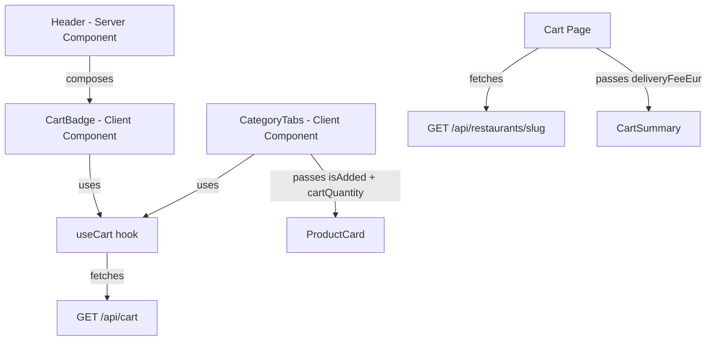

# Design Document: UX Improvements

## Overview

This design covers a UX polish pass for the Pueblo Delivery app. All changes are CSS/component-level — no API routes, database migrations, or new pages are introduced. The six requirements address: color unification (blue → green), add-to-cart feedback, desktop cart badge, delivery fee preview in the cart summary, fixing a misleading BottomNav link, and showing cart quantity on product cards.

The changes touch ~12 existing files and introduce 1 new client component (`CartBadge`). The architecture remains unchanged — this is purely a presentation-layer update.

## Architecture

No architectural changes. The existing Next.js App Router structure, API routes, and data flow remain intact.

The only structural consideration is the Header component: it is currently a **server component** (uses `await auth()`). To display a reactive cart badge, we introduce a small client component (`CartBadge`) that is composed into the server-rendered Header via standard React composition. The Header itself stays as a server component.



## Components and Interfaces

### Modified Components

**1. Button.tsx** (`src/components/ui/Button.tsx`)
- Change `primary` variant: `bg-blue-600` → `bg-green-600`, `hover:bg-blue-700` → `hover:bg-green-700`, `focus:ring-blue-500` → `focus:ring-green-500`
- Change `secondary` and `ghost` variants: `focus:ring-blue-500` → `focus:ring-green-500`

**2. Input.tsx** (`src/components/ui/Input.tsx`)
- Change focus ring: `focus:ring-blue-500` → `focus:ring-green-500`
- Change focus border: `focus:border-blue-500` → `focus:border-green-500`

**3. BottomNav.tsx** (`src/components/layout/BottomNav.tsx`)
- Change active color: `text-blue-600` → `text-green-600`
- Change focus ring: `focus:ring-blue-500` → `focus:ring-green-500`
- Change NAV_ITEMS[1]: `{ href: '/como-funciona', label: 'Buscar', icon: '🔍' }` → `{ href: '/', label: 'Explorar', icon: '🧭' }`

**4. FABCart.tsx** (`src/components/cart/FABCart.tsx`)
- Change background: `bg-blue-600` → `bg-green-600`, `hover:bg-blue-700` → `hover:bg-green-700`

**5. Login page** (`src/app/(public)/auth/login/page.tsx`)
- All `focus:border-blue-500` → `focus:border-green-500`
- All `focus:ring-blue-500` → `focus:ring-green-500`
- Submit button: `bg-blue-600` → `bg-green-600`, `hover:bg-blue-700` → `hover:bg-green-700`
- Links: `text-blue-600` → `text-green-600`

**6. Register page** (`src/app/(public)/auth/registro/page.tsx`)
- Same blue → green replacements as login page

**7. Cart page** (`src/app/(customer)/carrito/page.tsx`)
- Spinner: `border-blue-600` → `border-green-600`
- "Ver restaurantes" link: `bg-blue-600 hover:bg-blue-700` → `bg-green-600 hover:bg-green-700`
- "Ir al checkout" link: `bg-blue-600 hover:bg-blue-700` → `bg-green-600 hover:bg-green-700`
- Fetch restaurant delivery fee using `cart.restaurantId` and pass to CartSummary

**8. Profile page** (`src/app/(customer)/perfil/page.tsx`)
- Avatar: `bg-blue-100` → `bg-green-100`
- Focus rings on nav links: `focus:ring-blue-500` → `focus:ring-green-500`

**9. ProductCard.tsx** (`src/components/product/ProductCard.tsx`)
- Add optional props: `isAdded?: boolean`, `cartQuantity?: number`
- When `isAdded` is true: button shows "✓ Añadido" with `bg-green-700` background
- When `cartQuantity >= 1`: show a small badge with the quantity near the "Añadir" button

Updated interface:
```typescript
interface ProductCardProps {
  readonly product: { /* unchanged */ };
  readonly onAdd?: (productId: string) => void;
  readonly isAdded?: boolean;
  readonly cartQuantity?: number;
}
```

**10. CategoryTabs.tsx** (`src/app/(public)/restaurante/[slug]/CategoryTabs.tsx`)
- Use `useCart()` to access `cart.items`
- Pass `isAdded={addedProductId === product.id}` to each ProductCard
- Pass `cartQuantity` derived from `cart.items.find(i => i.productId === product.id)?.quantity ?? 0`

**11. CartSummary.tsx** (`src/components/cart/CartSummary.tsx`)
- Add optional prop: `deliveryFeeEur?: number | null` (null = loading, undefined = not provided)
- Add optional prop: `isLoadingFee?: boolean`
- Add optional prop: `feeError?: boolean`
- Display three rows: Subtotal, Envío (delivery fee), Total estimado

Updated interface:
```typescript
interface CartSummaryProps {
  readonly subtotalEur: number;
  readonly deliveryFeeEur?: number | null;
  readonly isLoadingFee?: boolean;
  readonly feeError?: boolean;
}
```

### New Components

**12. CartBadge.tsx** (`src/components/cart/CartBadge.tsx`)
- Client component (`'use client'`)
- Uses `useCart()` to get `itemCount`
- Renders a small green badge with the count next to the "Carrito" text
- Returns null when `itemCount === 0`

```typescript
// CartBadge.tsx — Client component for reactive cart count in Header
'use client';
import { useCart } from '@/hooks/use-cart';

export default function CartBadge() {
  const { itemCount } = useCart();
  if (itemCount === 0) return null;
  return (
    <span className="ml-1 inline-flex h-5 min-w-[20px] items-center justify-center rounded-full bg-green-600 px-1.5 text-xs font-bold text-white">
      {itemCount}
    </span>
  );
}
```

**13. Header.tsx** (`src/components/layout/Header.tsx`)
- Import and render `<CartBadge />` next to the "🛒 Carrito" link (desktop nav only)
- The Header remains a server component; CartBadge is a client island

## Data Models

No database migrations. One minor API serializer change:

- **Cart data**: `useCart()` hook provides `cart.items`, `itemCount`, `cart.restaurantId`
- **Delivery fee**: The cart API already joins the restaurant table to get `restaurantName`. We add `deliveryFeeEur` to the same serializer — a one-line change, no new endpoints needed.

**Design decision**: Rather than having the cart page make a second fetch to a restaurant endpoint (which would require slug lookup), we include `deliveryFeeEur` directly in the `CartDTO` response. The cart API already has the restaurant join, so this is trivial.

Updated CartDTO:
```typescript
export interface CartDTO {
  id: string;
  restaurantId: string | null;
  restaurantName: string | null;
  deliveryFeeEur: number | null;  // NEW — from restaurant
  items: CartItemDTO[];
  subtotalEur: number;
}
```

## Correctness Properties

*A property is a characteristic or behavior that should hold true across all valid executions of a system — essentially, a formal statement about what the system should do. Properties serve as the bridge between human-readable specifications and machine-verifiable correctness guarantees.*

Most of this feature is CSS class swaps and static UI rendering, which are not suitable for property-based testing. The one area with meaningful input variation is the CartSummary total calculation.

**Prework reflection**: Criteria 4.1 and 4.3 both test the same arithmetic invariant (total = subtotal + deliveryFee). These are consolidated into a single property.

### Property 1: Cart total equals subtotal plus delivery fee

*For any* non-negative subtotal and non-negative delivery fee, the estimated total displayed by CartSummary SHALL equal the sum of the subtotal and the delivery fee, rounded to two decimal places.

**Validates: Requirements 4.1, 4.3**

## Error Handling

| Scenario | Behavior |
|---|---|
| Delivery fee fetch fails (network error, missing restaurant) | CartSummary shows "Consultar en checkout" instead of the fee amount. Total row is hidden. |
| Cart is empty when CartBadge renders | CartBadge returns `null` — no badge shown. |
| `useCart()` is loading in CartBadge | CartBadge returns `null` until data is available (avoids flash of "0"). |
| `cart.restaurantId` is null (empty cart) on cart page | Skip delivery fee fetch entirely. CartSummary renders subtotal only. |
| ProductCard receives `cartQuantity` of 0 or undefined | No quantity badge rendered — default "Añadir" button. |

## Testing Strategy

### PBT Applicability Assessment

This feature is primarily CSS class changes and simple component prop rendering. **Property-based testing has very limited applicability** — only the CartSummary total calculation has a meaningful input space. All other changes are static class swaps or deterministic UI state rendering best covered by example-based tests.

### Property-Based Tests

- **Library**: `fast-check` (already available in the JS/TS ecosystem, pairs with Vitest)
- **Minimum iterations**: 100 per property
- **Tag format**: `Feature: ux-improvements, Property 1: Cart total equals subtotal plus delivery fee`

One property test:
1. Generate random `subtotalEur` (0–999.99) and `deliveryFeeEur` (0–20.00), render CartSummary, assert displayed total = subtotal + deliveryFee rounded to 2 decimal places.

### Unit Tests (Example-Based)

Organized by requirement:

**Req 1 — Color unification:**
- Snapshot or class-assertion tests for Button (primary variant), Input, BottomNav (active state), FABCart, login page, register page, cart page, profile page — verifying green-600 classes instead of blue.

**Req 2 — Add-to-cart feedback:**
- Render ProductCard with `isAdded=true` → assert "✓ Añadido" text and `bg-green-700` class
- Render ProductCard with `isAdded=false` → assert "Añadir" text
- Timer test: simulate add, assert feedback appears, advance 1500ms, assert revert

**Req 3 — Desktop cart badge:**
- Render CartBadge with mocked `useCart({ itemCount: 3 })` → assert "3" is displayed
- Render CartBadge with mocked `useCart({ itemCount: 0 })` → assert null/no output

**Req 4 — Delivery fee in CartSummary:**
- Render CartSummary with `deliveryFeeEur=2.50`, `subtotalEur=15.00` → assert all three rows visible
- Render CartSummary with `isLoadingFee=true` → assert loading indicator
- Render CartSummary with `feeError=true` → assert "Consultar en checkout"

**Req 5 — BottomNav fix:**
- Render BottomNav → assert second item has label "Explorar", icon "🧭", href "/"

**Req 6 — Cart quantity on ProductCard:**
- Render ProductCard with `cartQuantity=2` → assert badge shows "2"
- Render ProductCard with `cartQuantity=0` → assert no badge
